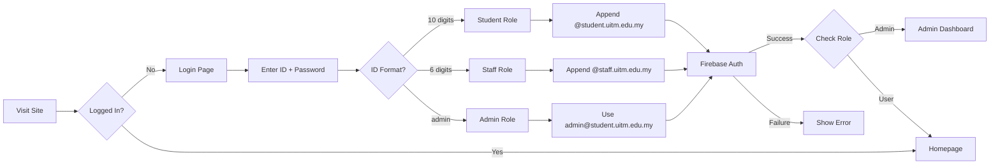
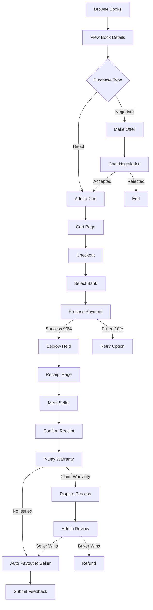
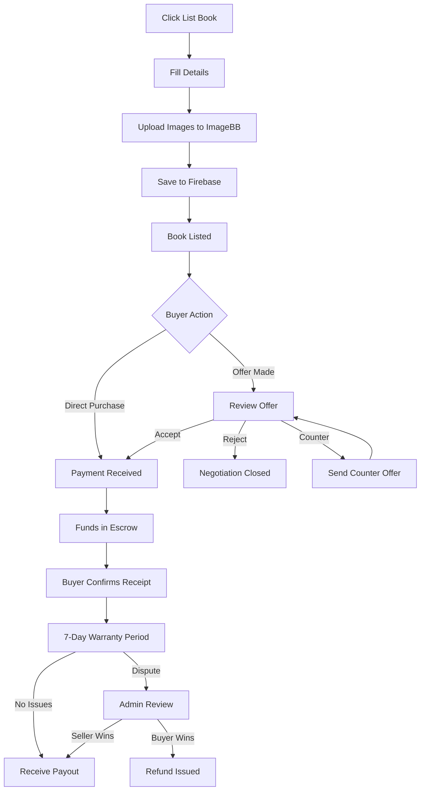
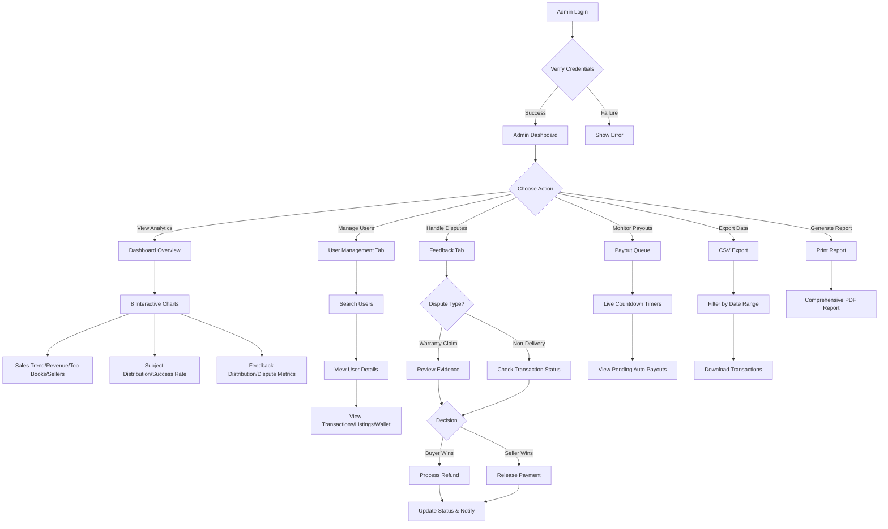
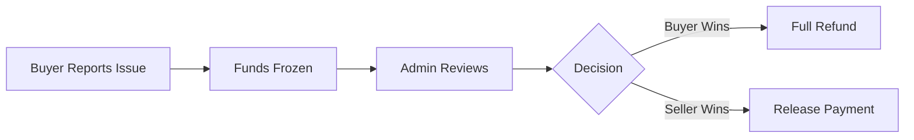
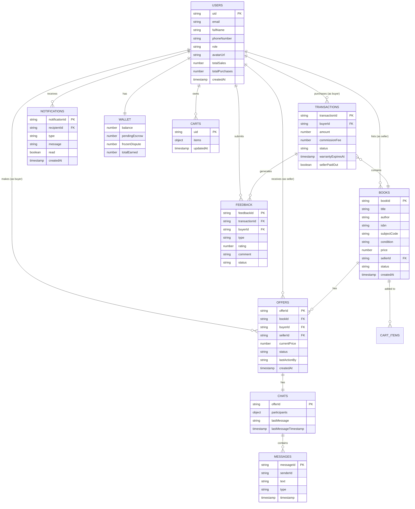

# 📚 UiTM Book e-Marketplace (UITM-EMPLC)

> A peer-to-peer textbook marketplace platform for UiTM Tapah Campus students and staff.


---

## 📑 Table of Contents

- [Overview](#overview)
- [Key Highlights](#key-highlights)
- [Features](#features)
- [Technology Stack](#technology-stack)
- [Project Structure](#project-structure)
- [Complete File Listing](#complete-file-listing)
- [System Workflows](#system-workflows)
- [Installation & Setup](#installation--setup)
- [Configuration](#configuration)
- [Test Credentials](#test-credentials)
- [Usage Guide](#usage-guide)
- [Database Structure](#database-structure)
- [Security Features](#security-features)
- [Core Utilities](#core-utilities)
- [System Constants](#system-constants)
- [Browser Requirements](#browser-requirements)
- [Documentation](#documentation)
- [Contributing](#contributing)
- [License](#license)
- [Acknowledgments](#acknowledgments)

---

## Overview

**UiTM Book e-Marketplace (UITM-EMPLC)** is a **Consumer-to-Consumer (C2C)** web platform designed specifically for UiTM students and staff to buy, sell, and negotiate prices for used textbooks. The system promotes sustainability, affordability, and trusted transactions within the UiTM community.

The platform features a secure escrow-based payment system, real-time negotiations with chat functionality, 7-day warranty protection, live countdown timers for transaction tracking, and a comprehensive admin dashboard with 8 interactive analytics charts.

---

## Key Highlights

| Feature | Description |
|---------|-------------|
| 🔐 **UiTM-only Authentication** | Restricted to `@student.uitm.edu.my` and `@staff.uitm.edu.my` domains |
| 💳 **Escrow Payment System** | Funds held securely until transaction completion |
| 🛡️ **7-Day Warranty Protection** | Buyer protection for quality assurance |
| 💬 **Real-time Negotiations** | Live chat between buyers and sellers for price negotiation |
| ⏱️ **Live Countdown Timers** | Real-time tracking of warranty and payout periods |
| 📊 **Admin Dashboard** | 8 interactive charts with comprehensive analytics |
| 🎨 **Role-Based Theming** | Purple accent for students, gold for staff |
| 🔔 **Real-time Notifications** | Instant alerts via Firebase listeners |

---

## Features

### 🔐 Authentication & User Management

| Feature | Description |
|---------|-------------|
| **UiTM Email Restriction** | Only `@student.uitm.edu.my` and `@staff.uitm.edu.my` domains allowed |
| **Email Verification** | Users must verify email before accessing the platform |
| **Role-Based Access** | Student, Staff, and Admin roles with different permissions |
| **Remember Me** | Optional session persistence for convenience |
| **Password Reset** | Email-based password recovery |
| **Profile Management** | Edit name, phone number, upload avatar |
| **Auto-Admin Creation** | First admin auto-created with special credentials (`admin/admin123`) |
| **Role Identification** | 10-digit ID = Student, 6-digit ID = Staff |

### 📚 Book Browsing & Search

| Feature | Description |
|---------|-------------|
| **Book Grid Display** | Visual cards with images, price, condition badges |
| **Real-time Search** | Search by title, author, or subject code |
| **Advanced Filters** | Filter by condition (New/Like New/Good/Fair), price range, campus location |
| **Sorting Options** | Sort by price (low/high), popularity, date added |
| **Book Details View** | Full info with image gallery, seller info |
| **Image Zoom** | Advanced zoom functionality for detailed book inspection |
| **Skeleton Loaders** | Smooth shimmer loading animations while fetching data |
| **Responsive Grid** | Adaptive layout for all screen sizes |

### 🛒 Shopping Cart

| Feature | Description |
|---------|-------------|
| **Add to Cart** | Add multiple books from different sellers |
| **Cart Persistence** | Cart saved to database, accessible across devices |
| **Remove Items** | Remove individual items from cart |
| **Price Summary** | Subtotal, commission fee (10%), and total display |
| **Availability Check** | Prevents purchasing already-sold books (race condition prevention) |
| **Empty Cart State** | Friendly message when cart is empty |

### 💬 Negotiation System

| Feature | Description |
|---------|-------------|
| **Make Offer** | Buyers can propose their own price |
| **Real-time Chat** | Live messaging between buyer and seller |
| **Counter Offers** | Back-and-forth price negotiation |
| **Accept/Reject** | Clear actions for offer management |
| **10x Price Cap** | Offers cannot exceed 10x original price |
| **Minimum Difference** | Counter-offers must differ by at least RM 0.50 |
| **System Messages** | Automated messages for actions taken |
| **Notifications** | Instant alerts for new offers and responses |
| **Rate Limiting** | 2-second cooldown between messages (500 char max) |
| **Proceed to Payment** | Direct checkout after offer acceptance |

### 💳 Payment System

| Feature | Description |
|---------|-------------|
| **FPX Simulation** | Malaysian bank payment simulation (90% success rate) |
| **Bank Selection** | Choose from multiple Malaysian banks (Maybank, CIMB, RHB, Public Bank, etc.) |
| **Meeting Scheduler** | Set date/time for book handover |
| **Price Breakdown** | Clear display of base price + 10% commission |
| **Race Condition Prevention** | Validates book availability before payment |
| **Payment Success/Failure** | Clear feedback with receipt generation |
| **PDF Receipt** | Downloadable receipt via jsPDF |

### 🛡️ Escrow & Warranty System

| Feature | Description |
|---------|-------------|
| **Escrow Hold** | Payment held for 7 days after purchase |
| **7-Day Warranty** | Buyer protection period for quality issues |
| **Confirm Receipt** | Buyer confirms satisfactory delivery |
| **Claim Warranty** | Report issues within warranty period |
| **Report Issue Modal** | Detailed issue reporting (wrong item, damaged, not received) |
| **Return Process** | Buyer sends item back, seller confirms receipt |
| **Auto-Payout** | Automatic release to seller after 7 days if no issues |
| **Auto-Refund** | If buyer doesn't confirm receipt in 7 days, admin can refund |
| **Funds Freezing** | Disputed funds frozen pending admin review |
| **Live Countdown Timer** | Real-time display of remaining warranty/payout time |

### ⏱️ Live Countdown Timer

| Feature | Description |
|---------|-------------|
| **Real-time Updates** | Timer updates every second |
| **Visual Progress** | Color-coded urgency indicators |
| **Buyer View** | Shows warranty expiration countdown |
| **Seller View** | Shows payout release countdown |
| **Expired State** | Clear indication when period has ended |

### 👤 User Profile

| Feature | Description |
|---------|-------------|
| **Profile Header** | Avatar, name, email, role badge, join date |
| **Role-Based Styling** | Purple theme for students, gold for staff |
| **Statistics Display** | Total listings, sales, purchases count |
| **My Listings Tab** | View all books currently listed |
| **Purchase History Tab** | View all purchases with visual timeline tracking |
| **Sales History Tab** | View all sales with payout status |
| **Negotiations Tab** | Manage active price negotiations |
| **Wallet Tab** | View balance, pending, frozen, total earned |
| **Edit Book Modal** | Edit existing book listings |
| **Delete Book** | Remove book listings |
| **Avatar Upload** | Custom profile picture via ImageBB |
| **Feedback History** | View submitted feedback and reviews |

### 💰 Wallet System

| Feature | Description |
|---------|-------------|
| **Available Balance** | Ready-to-withdraw earnings |
| **Pending Payout** | Funds in warranty period (escrow) |
| **Frozen (Disputes)** | Funds under admin review |
| **Total Earned** | Lifetime earnings tracker |
| **Payout History** | Full history of received payouts with timestamps |
| **Automatic Payouts** | System processes payouts after warranty expires |

### 📊 Transaction Timeline

| Feature | Description |
|---------|-------------|
| **Visual Progress** | Step-by-step transaction visualization with icons |
| **Buyer Timeline** | Paid → Escrow → Received → Warranty → Payout |
| **Seller Timeline** | Listed → Sold → Delivered → Warranty → Paid |
| **Timestamps** | Date/time for each milestone |
| **Status Indicators** | Color-coded progress (complete/active/pending) |
| **Tooltips** | Hover info explaining each step |
| **Live Countdown** | Real-time countdown for active stages |

### 🔔 Notification System

| Feature | Description |
|---------|-------------|
| **Real-time Notifications** | Instant updates via Firebase listeners |
| **Bell Icon Badge** | Unread count display in header |
| **Dropdown Preview** | Quick view of recent notifications (last 5) |
| **Notification History Page** | Full notification archive |
| **Type Icons** | Different colored icons for offers, purchases, disputes |
| **Mark as Read** | Individual and bulk "Mark all as read" |
| **Click Navigation** | Direct link to relevant pages |
| **Delete Notifications** | Remove unwanted notifications |
| **Admin Notifications** | Special alerts for dispute escalations |

### ⭐ Feedback System

| Feature | Description |
|---------|-------------|
| **Star Ratings** | 1-5 star rating system |
| **Feedback Types** | General feedback or dispute report |
| **Comment Box** | Detailed written feedback |
| **View Submitted Feedback** | Review your own feedback |
| **Dispute Escalation** | Flag issues for admin review |
| **Feedback Resolution** | Admin can resolve disputes |

### 🛠️ Admin Dashboard

| Feature | Description |
|---------|-------------|
| **Dashboard Overview** | Total users, transactions, revenue at a glance |
| **System Health** | Real-time monitoring of transaction success rates & issues |
| **Sales Trend Chart** | Line chart of transaction volume over time |
| **Revenue Chart** | Bar chart of commission earnings |
| **Top Books Chart** | Most sold books visualization |
| **Seller Leaderboard** | Top performing sellers (Student vs Staff) |
| **Subject Distribution** | Pie chart of book categories |
| **Transaction Success** | Critical analytics on completion vs failure rates |
| **Feedback Distribution** | Bar chart of rating distribution |
| **Dispute Metrics** | Opened vs resolved with resolution rate |
| **Offer Funnel** | Conversion tracking from offers to purchases |
| **Payout Queue** | Live countdowns for upcoming seller payouts |
| **Chart Filters** | Filter by time period (7 days, 30 days, all time) |
| **Recent Transactions** | Quick view of latest transactions |
| **User Management** | Search and view detailed user profiles |
| **Feedback Review** | View all user feedback and disputes |
| **Dispute Resolution** | Refund buyer OR pay seller actions |
| **CSV Export** | Download transactions as spreadsheet |
| **Real-time Updates** | Dashboard refreshes automatically |

### 🎨 UI/UX Features

| Feature | Description |
|---------|-------------|
| **Glassmorphism Design** | Modern frosted glass effects with blur |
| **Role-Based Theming** | Purple accent for students, gold for staff |
| **Smooth Animations** | CSS transitions and micro-animations |
| **Skeleton Loaders** | Shimmer loading placeholders |
| **Toast Notifications** | Non-intrusive success/error messages |
| **Responsive Design** | Mobile-friendly layouts |
| **Loading Overlays** | Full-screen spinners for long operations |
| **Modal Dialogs** | Clean popup interfaces |
| **Welcome Messages** | Personalized greeting with role icon |
| **Info Tooltips** | Helpful explanations throughout |
| **Icon Enhancements** | Font Awesome 6 icons throughout |

### 🔧 Developer Features

| Feature | Description |
|---------|-------------|
| **ESLint Configuration** | Code quality enforcement |
| **Utility Helpers** | Sanitization, validation, debounce functions |
| **Centralized Constants** | COMMISSION_RATE, WARRANTY_PERIOD, etc. |
| **Error Handling** | Consistent error messaging |
| **PDF Receipt Generation** | jsPDF integration for receipts |
| **Image Upload** | ImageBB API integration |
| **Modal Scroll Fix** | Prevents body scroll when modals are open |

---

## Technology Stack

| Category | Technology |
|----------|------------|
| **Frontend** | HTML5, CSS3, JavaScript (ES6+) |
| **Backend** | Firebase Realtime Database |
| **Authentication** | Firebase Authentication |
| **Hosting Options** | Cloudflare Pages / http-server (local) / Wrangler |
| **Image Hosting** | ImageBB API |
| **Charts** | Chart.js |
| **PDF Generation** | jsPDF |
| **Icons** | Font Awesome 6.4 |
| **Design System** | Custom CSS with Glassmorphism |

---

## Project Structure

```
UITM-EMPLC_ver1/
│
├── index.html                    # Homepage - Book browsing & listing
├── launch.html                   # Launch/landing page
│
├── pages/                        # 12 HTML pages (14 total including root)
│   ├── admin.html               # Admin dashboard (38KB)
│   ├── login.html               # Login page
│   ├── signup.html              # Registration page
│   ├── verify-email.html        # Email verification
│   ├── book-details.html        # Individual book view
│   ├── cart.html                # Shopping cart
│   ├── chat.html                # Negotiation chat
│   ├── feedback.html            # Feedback form
│   ├── notifications.html       # Notification history
│   ├── payment.html             # Payment processing
│   ├── profile.html             # User profile & history (38KB)
│   └── receipt.html             # Transaction receipt
│
├── assets/
│   ├── css/                     # 21 CSS files
│   │   ├── styles.css           # Main stylesheet (83KB)
│   │   ├── animations.css       # CSS animations & keyframes
│   │   ├── skeleton-loaders.css # Loading animations
│   │   ├── uitm-glassmorphism.css # Glassmorphism effects
│   │   ├── role-based-styles.css  # Student/Staff theming
│   │   ├── transaction-timeline.css # Timeline UI
│   │   ├── notifications.css    # Notification styling
│   │   ├── profile-enhancements.css # Profile page styling
│   │   ├── cart.css             # Cart page styling
│   │   ├── image-zoom.css       # Image zoom modal
│   │   ├── welcome-message.css  # Welcome message styling
│   │   ├── header-balance.css   # Header balance display
│   │   ├── icon-enhancements.css # Icon styling
│   │   ├── info-tooltips.css    # Tooltip styling
│   │   ├── ui-fixes.css         # UI fixes & adjustments
│   │   ├── auth-enhancements.css # Auth page styling
│   │   ├── payment-enhancements.css # Payment page styling
│   │   ├── admin-notifications.css # Admin notification styling
│   │   ├── profile-cover-premium.css # Profile cover styling
│   │   ├── uitm-animations.css  # UiTM branded animations
│   │   └── styles_backup.css    # Backup stylesheet
│   │
│   ├── js/                      # 23 JavaScript files
│   │   ├── firebase-config.js   # Firebase setup & core utilities (17KB)
│   │   ├── auth.js              # Authentication logic (13KB)
│   │   ├── app.js               # Shared app functionality (16KB)
│   │   ├── admin.js             # Admin dashboard (122KB)
│   │   ├── profile.js           # Profile & wallet (82KB)
│   │   ├── payment.js           # Payment processing (13KB)
│   │   ├── homepage.js          # Book browsing & filters (12KB)
│   │   ├── book-details.js      # Book view & edit modal (15KB)
│   │   ├── cart.js              # Shopping cart (5KB)
│   │   ├── chat.js              # Negotiation system (19KB)
│   │   ├── notifications.js     # Notification dropdown (20KB)
│   │   ├── notification-history.js # Full notification page (16KB)
│   │   ├── countdown-timer.js   # Live countdown functionality (8KB)
│   │   ├── image-zoom.js        # Image zoom modal (17KB)
│   │   ├── profile-feedback.js  # Profile feedback tab (10KB)
│   │   ├── receipt.js           # Receipt generation (7KB)
│   │   ├── role-filter.js       # Role-based filtering (8KB)
│   │   ├── utils.js             # Utility helpers (8KB)
│   │   ├── verify-email.js      # Email verification (2KB)
│   │   ├── admin-notifications.js # Admin notification logic (3KB)
│   │   ├── modal-scroll-fix.js  # Modal scroll prevention (1KB)
│   │   ├── test-notification.js # Notification testing (3KB)
│   │   └── seed_placeholder.js  # Placeholder seeding (1KB)
│   │
│   └── images/                  # Static assets (logos, icons)
│
├── config/                      # Configuration files
│   ├── firebase-rules.json      # Firebase security rules (3KB)
│   ├── firebase.json            # Firebase config
│   ├── .firebaserc              # Firebase project config
│   └── presentation-dummy-data.json # Demo data (41KB)
│
├── file_md/                     # Documentation Archive
│   ├── documentation/           # General documentation
│   ├── guides/                  # User and admin guides
│   ├── screenshots/             # System screenshots
│   └── technical/               # Technical designs & diagrams
│
│
├── backup/                      # Backup files (16 files)
├── dev/                         # Development files (5 files)
│
├── .eslintrc.json               # ESLint configuration
├── .gitignore                   # Git ignore file
├── package.json                 # NPM scripts & dependencies
├── package-lock.json            # NPM lock file
├── update-html-css.ps1          # PowerShell update script
├── UAT.md                       # User Acceptance Testing Questions
└── README.md                    # This file
```

---

## Complete File Listing

### HTML Pages (12 files)

| File | Size | Description |
|------|------|-------------|
| `index.html` | 13KB | Homepage with book browsing, search, filters, and listing modal |
| `launch.html` | 7KB | Launch/landing page |
| `pages/admin.html` | 38KB | Admin dashboard with 8 charts and management tabs |
| `pages/book-details.html` | 12KB | Individual book view with image gallery |
| `pages/cart.html` | 7KB | Shopping cart with checkout |
| `pages/chat.html` | 13KB | Negotiation chat interface |
| `pages/feedback.html` | 7KB | Feedback submission form |
| `pages/login.html` | 3KB | User login page |
| `pages/signup.html` | 4KB | User registration page |
| `pages/notifications.html` | 11KB | Full notification history |
| `pages/payment.html` | 7KB | FPX payment simulation |
| `pages/profile.html` | 39KB | User profile with 5 tabs |
| `pages/receipt.html` | 11KB | Transaction receipt with PDF export |
| `pages/verify-email.html` | 2KB | Email verification page |

### JavaScript Files (23 files)

| File | Size | Description |
|------|------|-------------|
| `admin.js` | 122KB | Admin dashboard logic, all 8 charts, user/feedback management |
| `profile.js` | 82KB | Profile tabs, wallet, listings, purchase/sales history, negotiations |
| `notifications.js` | 20KB | Notification dropdown, real-time listener, badge updates |
| `chat.js` | 19KB | Negotiation chat, real-time messaging, offer actions |
| `firebase-config.js` | 17KB | Firebase init, auth helpers, core utilities, constants |
| `image-zoom.js` | 17KB | Advanced image zoom modal functionality |
| `notification-history.js` | 16KB | Full notification history page logic |
| `app.js` | 16KB | Shared functionality, header, navigation |
| `book-details.js` | 15KB | Book details view, edit modal, image gallery |
| `auth.js` | 13KB | Login, signup, email verification, auto-admin |
| `payment.js` | 13KB | FPX payment simulation, transaction creation |
| `homepage.js` | 12KB | Book grid, search, filters, listing modal |
| `profile-feedback.js` | 11KB | Profile feedback tab functionality |
| `countdown-timer.js` | 9KB | Live countdown timer for warranty/payout |
| `utils.js` | 8KB | Utility helpers (sanitization, validation, debounce) |
| `role-filter.js` | 8KB | Role-based filtering and display |
| `receipt.js` | 8KB | Receipt display and PDF generation |
| `cart.js` | 5KB | Shopping cart operations |
| `admin-notifications.js` | 3KB | Admin-specific notification logic |
| `test-notification.js` | 3KB | Notification testing utilities |
| `verify-email.js` | 2KB | Email verification logic |
| `modal-scroll-fix.js` | 1KB | Fix for modal scroll issues |
| `seed_placeholder.js` | 1KB | Placeholder data seeding |

### Documentation Files

| File | Size | Description |
|------|------|-------------|
| `README.md` | 54KB | Main system documentation (this file) |
| `UAT.md` | 4KB | User Acceptance Testing questionnaire |
| `file_md/` | - | Comprehensive documentation archive |

### CSS Files (21 files)

| File | Size | Description |
|------|------|-------------|
| `styles.css` | 83KB | Main stylesheet with all base styles |
| `uitm-glassmorphism.css` | 15KB | Glassmorphism effects (frosted glass) |
| `notifications.css` | 13KB | Notification dropdown and history styling |
| `transaction-timeline.css` | 13KB | Transaction timeline visualization |
| `role-based-styles.css` | 13KB | Student (purple) and Staff (gold) theming |
| `icon-enhancements.css` | 12KB | Icon styling and animations |
| `profile-enhancements.css` | 11KB | Profile page enhanced styling |
| `ui-fixes.css` | 11KB | UI fixes and adjustments |
| `cart.css` | 10KB | Shopping cart styling |
| `uitm-animations.css` | 10KB | UiTM branded animations |
| `animations.css` | 7KB | CSS animations and keyframes |
| `welcome-message.css` | 7KB | Welcome message component |
| `image-zoom.css` | 6KB | Image zoom modal styling |
| `profile-cover-premium.css` | 5KB | Profile cover styling |
| `header-balance.css` | 4KB | Header balance display |
| `auth-enhancements.css` | 4KB | Authentication page enhancements |
| `payment-enhancements.css` | 4KB | Payment page enhancements |
| `skeleton-loaders.css` | 4KB | Skeleton loading animations |
| `info-tooltips.css` | 2KB | Tooltip styling |
| `admin-notifications.css` | 2KB | Admin notification styling |
| `styles_backup.css` | 82KB | Backup of main stylesheet |

---

## System Workflows

### 1. Authentication Flow



**Key Files:**
- `pages/login.html` - Login UI
- `pages/signup.html` - Registration UI
- `assets/js/auth.js` - Authentication logic
- `assets/js/firebase-config.js` - Firebase initialization

### 2. Buyer Flow



**Key Files:**
- `index.html` - Book browsing
- `pages/book-details.html` - Book view
- `pages/cart.html` - Shopping cart
- `pages/payment.html` - Payment processing
- `assets/js/payment.js` - Transaction logic

### 3. Seller Flow



**Key Files:**
- `assets/js/homepage.js` - Book listing modal
- `pages/profile.html` - Sales history
- `assets/js/profile.js` - Wallet & payouts

### 4. Administrator Flow



**Admin Dashboard Sections:**

| Section | Description |
|---------|-------------|
| **Overview Stats** | Total users, books, transactions, revenue, commission |
| **System Health** | Real-time monitoring of success rates & issues |
| **Charts (8 total)** | Sales Trend, Revenue, Top Books, Top Sellers, Subject Distribution, Transaction Success, Feedback Distribution, Dispute Resolution |
| **Payout Queue** | Live countdown timers for pending auto-payouts |
| **Recent Transactions** | Quick view of latest platform activity |
| **User Management** | Search, view profiles, check transaction history |
| **Feedback Review** | View all feedback, resolve disputes |

**Admin Dispute Resolution Actions:**

| Action | When to Use | Result |
|--------|-------------|--------|
| **Refund Buyer** | Non-delivery, wrong item, damaged goods | Full refund to buyer, seller not paid |
| **Pay Seller** | Buyer didn't return book, false claim | Release escrow to seller |
| **Auto-Refund** | No "Order Received" in 7 days | System suggests refund |
| **Auto-Payout** | Warranty claimed but no return in 7 days | System releases payment |

**Key Files:**
- `pages/admin.html` - Admin dashboard UI
- `assets/js/admin.js` - Dashboard logic, charts, dispute resolution
  - `resolveDisputeForBuyer()` - Process buyer refund
  - `resolveDisputeForSeller()` - Release seller payment
  - `loadCharts()` - Initialize 8 analytics charts
  - `exportTransactionsToCSV()` - Export transaction data

### 5. Escrow & Warranty System

```
Payment Flow:
┌─────────────────────────────────────────────────────────────┐
│                                                             │
│   BUYER PAYS  →  ESCROW HELD  →  WARRANTY PERIOD (7 Days)  │
│        │              │                   │                 │
│        │              │           ┌───────┴────────┐        │
│        │              │           │                │        │
│        │              │      No Issues        Warranty      │
│        │              │           │            Claimed      │
│        │              │           ↓                │        │
│        │              │    AUTO RELEASE       ┌────┴────┐   │
│        │              │    TO SELLER          │         │   │
│        │              │                   Refund    Seller  │
│        │              │                   Buyer     Wins    │
│                                                             │
└─────────────────────────────────────────────────────────────┘
```

**Timeout Logic:**
- If buyer doesn't confirm "Order Received" within 7 days → Admin can refund buyer (assume non-delivery)
- If buyer claims warranty but doesn't return book within 7 days → Auto-payout to seller (buyer accepts condition)

### 6. Admin Dispute Resolution



**Key Files:**
- `pages/admin.html` - Admin dashboard
- `assets/js/admin.js` - Dispute resolution functions
  - `resolveDisputeForBuyer()` - Refund buyer
  - `resolveDisputeForSeller()` - Pay seller

---

## Installation & Setup

### Prerequisites

- Node.js ≥14.0.0
- npm or yarn
- Firebase project (with Realtime Database and Authentication enabled)
- ImageBB API key (for image uploads)

### Quick Start

```bash
# Clone the repository
git clone https://github.com/qieyl345/UITM-EMPLC_design-ver1.git

# Navigate to project
cd UITM-EMPLC_ver1

# Install dependencies
npm install

# Start development server
npm run dev

# Open in browser
# Visit http://localhost:8080
```

### Available Scripts

| Command | Description |
|---------|-------------|
| `npm run dev` | Start http-server on port 8080 |
| `npm run start` | Same as dev |
| `npm run serve` | Start server and open browser automatically |
| `npm run lint` | Run ESLint code checks with auto-fix |

---

## Configuration

### Firebase Setup

1. Create a Firebase project at [console.firebase.google.com](https://console.firebase.google.com)
2. Enable **Authentication** (Email/Password provider)
3. Enable **Realtime Database**
4. Update `assets/js/firebase-config.js`:

```javascript
const firebaseConfig = {
    apiKey: "YOUR_API_KEY",
    authDomain: "YOUR_PROJECT.firebaseapp.com",
    databaseURL: "https://YOUR_PROJECT.firebaseio.com",
    projectId: "YOUR_PROJECT_ID",
    storageBucket: "YOUR_PROJECT.appspot.com",
    messagingSenderId: "YOUR_SENDER_ID",
    appId: "YOUR_APP_ID"
};
```

### Firebase Security Rules

Deploy the security rules from `config/firebase-rules.json`:

```json
{
    "rules": {
        "users": {
            ".read": "auth != null",
            "$uid": {
                ".write": "auth != null && (auth.uid == $uid || root.child('users/' + auth.uid + '/role').val() == 'admin')"
            }
        },
        "books": {
            ".read": "auth != null",
            "$bookId": {
                ".write": "..."
            }
        }
        // ... see config/firebase-rules.json for full rules
    }
}
```

### ImageBB Setup

1. Get an API key from [api.imgbb.com](https://api.imgbb.com/)
2. The API key is configured in `assets/js/firebase-config.js`

---

## Test Credentials

| Role | ID | Password | Full Email |
|------|-----|----------|------------|
| **Student** | `2024745815` | `2024745815` | `2024745815@student.uitm.edu.my` |
| **Staff** | `709265` | `70926500` | `709265@staff.uitm.edu.my` |
| **Admin** | `admin` | `admin123` | `admin@student.uitm.edu.my` |

> **Note:** The admin account is auto-created on first login attempt with `admin/admin123`.

---

## Usage Guide

### User Roles & Permissions

| Role | Access | Email Domain | Identifier |
|------|--------|--------------|------------|
| **Student** | Buy, Sell, Negotiate | @student.uitm.edu.my | 10-digit ID |
| **Staff** | Buy, Sell, Negotiate | @staff.uitm.edu.my | 6-digit ID |
| **Admin** | Full Dashboard Access | Special credentials | `admin` |

### Permission Matrix

| Action | Student | Staff | Admin |
|--------|:-------:|:-----:|:-----:|
| Browse books | ✅ | ✅ | ✅ |
| List books for sale | ✅ | ✅ | ❌ |
| Make offers | ✅ | ✅ | ❌ |
| Accept/Reject offers | ✅ | ✅ | ❌ |
| Chat in negotiations | ✅ | ✅ | ❌ |
| Purchase books | ✅ | ✅ | ❌ |
| Submit feedback | ✅ | ✅ | ❌ |
| View admin dashboard | ❌ | ❌ | ✅ |
| Resolve disputes | ❌ | ❌ | ✅ |
| View all feedback | ❌ | ❌ | ✅ |
| Manage users | ❌ | ❌ | ✅ |

### Transaction Statuses

| Status | Description |
|--------|-------------|
| `pending_payment` | Awaiting payment |
| `payment_held` | Escrow active, awaiting delivery |
| `delivered` | Buyer confirmed receipt |
| `completed` | Transaction finished, seller paid |
| `warranty_claimed` | Buyer filed warranty claim |
| `return_sent` | Buyer sent item back |
| `return_received` | Seller received returned item |
| `refunded` | Buyer refunded |
| `dispute_open` | Under admin review |
| `failed` | Transaction failed |

### Key URLs

| Page | URL |
|------|-----|
| Homepage | `/index.html` |
| Login | `/pages/login.html` |
| Signup | `/pages/signup.html` |
| Profile | `/pages/profile.html` |
| Cart | `/pages/cart.html` |
| Payment | `/pages/payment.html` |
| Chat | `/pages/chat.html?offerId=xxx` |
| Admin | `/pages/admin.html` |
| Notifications | `/pages/notifications.html` |
| Receipt | `/pages/receipt.html?txn=xxx` |

---

## Database Structure

### Entity Relationship Diagram (ERD)



### Entity Relationships

| Relationship | Type | Description |
|--------------|------|-------------|
| User → Books | One-to-Many | One seller can list many books |
| User → Transactions | One-to-Many | One buyer can have many transactions |
| User → Offers | One-to-Many | Users participate in many offers (as buyer or seller) |
| User → Wallet | One-to-One | Each user has exactly one wallet |
| User → Cart | One-to-One | Each user has one shopping cart |
| Book → Offers | One-to-Many | One book can have multiple offers |
| Offer → Chat | One-to-One | Each offer has one chat room |
| Chat → Messages | One-to-Many | One chat contains many messages |
| Transaction → Feedback | One-to-Many | One transaction can have feedback entries |

### Firebase Realtime Database Schema

```
/ (root)
├── users/
│   └── {uid}/
│       ├── email: string
│       ├── fullName: string
│       ├── phoneNumber: string
│       ├── role: "student" | "staff" | "admin"
│       ├── avatarUrl: string (optional)
│       ├── campusLocation: string
│       ├── totalSales: number
│       ├── totalPurchases: number
│       ├── createdAt: timestamp
│       └── wallet/
│           ├── balance: number
│           ├── pendingEscrow: number
│           ├── frozenDispute: number
│           ├── totalEarned: number
│           └── payoutHistory/
│               └── {payoutId}/
│
├── books/
│   └── {bookId}/
│       ├── title: string
│       ├── author: string
│       ├── isbn: string
│       ├── subjectCode: string
│       ├── condition: "New" | "Like New" | "Good" | "Fair"
│       ├── price: number
│       ├── description: string
│       ├── campusLocation: string
│       ├── images: array<string>
│       ├── sellerId: uid
│       ├── sellerName: string
│       ├── status: "available" | "sold"
│       ├── viewCount: number
│       └── createdAt: timestamp
│
├── transactions/
│   └── {transactionId}/
│       ├── transactionId: string
│       ├── buyerId: uid
│       ├── buyerName: string
│       ├── buyerEmail: string
│       ├── items: array<CartItem>
│       ├── amount: number
│       ├── basePrice: number
│       ├── commissionFee: number
│       ├── status: string
│       ├── selectedBank: string
│       ├── meetingDate: string
│       ├── createdAt: timestamp
│       ├── deliveryStatus: string
│       ├── actualDeliveryDate: timestamp
│       ├── warrantyExpiresAt: timestamp
│       ├── escrowHeldAt: timestamp
│       ├── autoReleaseAt: timestamp
│       ├── sellerPaidOut: boolean
│       └── sellerPayoutAmount: number
│
├── offers/
│   └── {offerId}/
│       ├── bookId: string
│       ├── bookTitle: string
│       ├── bookPrice: number
│       ├── buyerId: uid
│       ├── buyerName: string
│       ├── sellerId: uid
│       ├── sellerName: string
│       ├── currentPrice: number
│       ├── status: "pending" | "counter_offered" | "accepted" | "rejected"
│       ├── lastActionBy: uid
│       ├── createdAt: timestamp
│       └── updatedAt: timestamp
│
├── chats/
│   └── {offerId}/
│       ├── participants/
│       │   ├── {buyerId}: true
│       │   └── {sellerId}: true
│       ├── lastMessage: string
│       ├── lastMessageTimestamp: timestamp
│       └── messages/
│           └── {messageId}/
│               ├── senderId: uid | "system"
│               ├── senderName: string
│               ├── text: string
│               ├── type: "text" | "system"
│               └── timestamp: timestamp
│
├── notifications/
│   └── {notificationId}/
│       ├── recipientId: uid
│       ├── senderId: uid
│       ├── senderName: string
│       ├── type: string
│       ├── message: string
│       ├── offerId: string (optional)
│       ├── bookId: string (optional)
│       ├── transactionId: string (optional)
│       ├── read: boolean
│       └── createdAt: timestamp
│
├── feedback/
│   └── {feedbackId}/
│       ├── transactionId: string
│       ├── buyerId: uid
│       ├── buyerName: string
│       ├── sellerId: uid
│       ├── sellerName: string
│       ├── type: "review" | "dispute"
│       ├── rating: number (1-5)
│       ├── comment: string
│       ├── status: "pending" | "resolved"
│       └── createdAt: timestamp
│
└── carts/
    └── {uid}/
        ├── items/
        │   └── {bookId}/ (cart item details)
        └── updatedAt: timestamp
```

### Example JSON Data

#### Users Collection

```json
{
  "users": {
    "abc123xyz": {
      "email": "2024745815@student.uitm.edu.my",
      "fullName": "Ahmad Razif bin Abdullah",
      "phoneNumber": "0123456789",
      "role": "student",
      "avatarUrl": "https://i.ibb.co/avatar.jpg",
      "campusLocation": "UiTM Tapah",
      "totalSales": 5,
      "totalPurchases": 3,
      "createdAt": 1704067200000,
      "wallet": {
        "balance": 150.50,
        "pendingEscrow": 45.00,
        "frozenDispute": 0,
        "totalEarned": 250.00
      }
    }
  }
}
```

#### Books Collection

```json
{
  "books": {
    "-NxYz123abc": {
      "title": "Data Structures and Algorithms",
      "author": "Thomas H. Cormen",
      "isbn": "978-0262033848",
      "subjectCode": "CSC203",
      "condition": "Good",
      "price": 45.00,
      "description": "Minor highlighting on pages 50-80, otherwise excellent condition",
      "campusLocation": "UiTM Tapah",
      "images": [
        "https://i.ibb.co/book1.jpg",
        "https://i.ibb.co/book2.jpg"
      ],
      "sellerId": "abc123xyz",
      "sellerName": "Ahmad Razif",
      "status": "available",
      "viewCount": 42,
      "createdAt": 1704153600000
    }
  }
}
```

#### Transactions Collection

```json
{
  "transactions": {
    "TXN1704240000000": {
      "transactionId": "TXN1704240000000",
      "buyerId": "def456uvw",
      "buyerName": "Siti Aminah",
      "buyerEmail": "2024123456@student.uitm.edu.my",
      "items": [
        {
          "bookDetails": {
            "id": "-NxYz123abc",
            "title": "Data Structures and Algorithms",
            "price": 45.00,
            "sellerId": "abc123xyz"
          }
        }
      ],
      "amount": 49.50,
      "basePrice": 45.00,
      "commissionFee": 4.50,
      "status": "delivered",
      "selectedBank": "Maybank",
      "meetingDate": "2026-01-10",
      "createdAt": 1704240000000,
      "deliveryStatus": "completed",
      "actualDeliveryDate": 1704326400000,
      "warrantyExpiresAt": 1704931200000,
      "escrowHeldAt": 1704240000000,
      "autoReleaseAt": 1704931200000,
      "sellerPaidOut": false,
      "sellerPayoutAmount": 40.50
    }
  }
}
```

#### Offers Collection

```json
{
  "offers": {
    "-NxOffer789": {
      "bookId": "-NxYz123abc",
      "bookTitle": "Data Structures and Algorithms",
      "bookPrice": 45.00,
      "buyerId": "def456uvw",
      "buyerName": "Siti Aminah",
      "sellerId": "abc123xyz",
      "sellerName": "Ahmad Razif",
      "currentPrice": 40.00,
      "status": "accepted",
      "lastActionBy": "abc123xyz",
      "createdAt": 1704200000000,
      "updatedAt": 1704210000000
    }
  }
}
```

#### Chats Collection

```json
{
  "chats": {
    "-NxOffer789": {
      "participants": {
        "abc123xyz": true,
        "def456uvw": true
      },
      "lastMessage": "Deal! I accept RM 40",
      "lastMessageTimestamp": 1704210000000,
      "messages": {
        "-NxMsg001": {
          "senderId": "def456uvw",
          "senderName": "Siti Aminah",
          "text": "Hi, can I get this for RM 35?",
          "type": "text",
          "timestamp": 1704200000000
        },
        "-NxMsg002": {
          "senderId": "system",
          "senderName": "System",
          "text": "Offer made: RM 35.00",
          "type": "system",
          "timestamp": 1704200001000
        },
        "-NxMsg003": {
          "senderId": "abc123xyz",
          "senderName": "Ahmad Razif",
          "text": "How about RM 40? It's in great condition",
          "type": "text",
          "timestamp": 1704205000000
        }
      }
    }
  }
}
```

#### Notifications Collection

```json
{
  "notifications": {
    "-NxNotif001": {
      "recipientId": "abc123xyz",
      "senderId": "def456uvw",
      "senderName": "Siti Aminah",
      "type": "offer",
      "message": "Siti Aminah offered RM 35.00 for \"Data Structures and Algorithms\"",
      "offerId": "-NxOffer789",
      "bookId": "-NxYz123abc",
      "read": false,
      "createdAt": 1704200000000
    }
  }
}
```

#### Feedback Collection

```json
{
  "feedback": {
    "-NxFeedback001": {
      "transactionId": "TXN1704240000000",
      "buyerId": "def456uvw",
      "buyerName": "Siti Aminah",
      "sellerId": "abc123xyz",
      "sellerName": "Ahmad Razif",
      "type": "review",
      "rating": 5,
      "comment": "Great seller! Book was in excellent condition as described. Fast response too!",
      "status": "pending",
      "createdAt": 1704326400000
    }
  }
}
```

### Field Descriptions

#### User Fields

| Field | Type | Required | Description |
|-------|------|----------|-------------|
| `email` | string | ✅ | UiTM email address |
| `fullName` | string | ✅ | User's full name |
| `phoneNumber` | string | ❌ | Contact number |
| `role` | enum | ✅ | `student`, `staff`, or `admin` |
| `avatarUrl` | string | ❌ | Profile picture URL |
| `campusLocation` | string | ❌ | Campus for meetups |
| `totalSales` | number | ✅ | Count of completed sales |
| `totalPurchases` | number | ✅ | Count of completed purchases |
| `createdAt` | timestamp | ✅ | Account creation time |

#### Wallet Fields

| Field | Type | Description |
|-------|------|-------------|
| `balance` | number | Available withdrawable balance |
| `pendingEscrow` | number | Funds held awaiting buyer confirmation |
| `frozenDispute` | number | Funds frozen during warranty claims |
| `totalEarned` | number | Lifetime earnings (after commission) |

#### Book Fields

| Field | Type | Required | Description |
|-------|------|----------|-------------|
| `title` | string | ✅ | Book title |
| `author` | string | ✅ | Book author |
| `isbn` | string | ❌ | ISBN number |
| `subjectCode` | string | ✅ | Course code (e.g., CSC203) |
| `condition` | enum | ✅ | `New`, `Like New`, `Good`, `Fair` |
| `price` | number | ✅ | Listing price in RM |
| `description` | string | ❌ | Additional details |
| `campusLocation` | string | ✅ | Meetup location |
| `images` | array | ✅ | ImageBB URLs (max 5) |
| `sellerId` | string | ✅ | Seller's UID |
| `status` | enum | ✅ | `available` or `sold` |

#### Transaction Status Values

| Status | Description |
|--------|-------------|
| `pending_payment` | Awaiting buyer payment |
| `payment_held` | Escrow active, awaiting meetup |
| `delivered` | Buyer confirmed receipt |
| `completed` | Seller paid, transaction finished |
| `warranty_claimed` | Buyer filed warranty issue |
| `return_sent` | Buyer sent item back |
| `return_received` | Seller confirmed return |
| `refunded` | Buyer refunded |
| `dispute_open` | Under admin review |
| `failed` | Payment failed |

---


## Security Features

### Authentication Security

| Feature | Implementation |
|---------|----------------|
| **Email Domain Restriction** | Only UiTM emails accepted |
| **Firebase Authentication** | Secure email/password auth |
| **Email Verification** | Required before full access |
| **Session Management** | Optional persistence (Remember Me) |
| **Role Identification** | Automatic based on email format |

### Database Security

| Feature | Implementation |
|---------|----------------|
| **Role-based Access Control** | Firebase security rules |
| **User Isolation** | Users can only modify own data |
| **Admin-only Operations** | Sensitive operations restricted |
| **Wallet Protection** | No direct wallet modification allowed |
| **Chat Privacy** | Only offer participants can access |

### Client-Side Protection

| Feature | Implementation |
|---------|----------------|
| **Input Sanitization** | `escapeHtml()` utility function |
| **XSS Prevention** | `safeSetText()` for text content |
| **Form Validation** | Client-side validation helpers |
| **Rate Limiting** | Message cooldown (2 seconds) |

### Financial Security

| Feature | Implementation |
|---------|----------------|
| **Escrow Protection** | Funds held during warranty |
| **7-Day Warranty** | Buyer protection period |
| **Dispute Resolution** | Admin-controlled fund release |
| **Commission Deduction** | Deducted at payout time |

---

## Core Utilities

### firebase-config.js

```javascript
// Key Functions
waitForAuth()               // Wait for Firebase auth initialization
isAdmin()                   // Check if current user is admin
requireAdmin()              // Redirect non-admins away
formatCurrency(amount)      // Format as "RM X.XX"
formatDate(timestamp)       // Format date string
formatRelativeTime(timestamp) // Format as "2 hours ago"
showNotification(msg, type) // Display toast notification
checkAndProcessAutoPayouts()  // Process automatic payouts
createNotification(...)     // Create notification in database

// Constants
COMMISSION_RATE = 0.10        // 10% platform fee
WARRANTY_PERIOD_DAYS = 7      // 7-day protection
AUTO_RELEASE_DAYS = 7         // Auto-payout after 7 days
```

### utils.js

```javascript
// Sanitization
escapeHtml(text)            // Prevent XSS attacks
safeSetText(el, text)       // Safe text content setter
sanitizeHtml(html)          // DOMPurify sanitization

// Performance
debounce(fn, delay)         // Debounce function calls
throttle(fn, limit)         // Throttle function calls

// Validation
isValidEmail(email)         // Email format check
isValidUitmEmail(email)     // UiTM domain check
isValidPrice(value)         // Price validation
handleError(error, msg)     // Consistent error handling

// UX
showSkeletonLoader(container, type, count)
hideSkeletonLoader(container)
```

---

## System Constants

| Constant | Value | Description | Location |
|----------|-------|-------------|----------|
| `COMMISSION_RATE` | 0.10 (10%) | Platform commission fee | `firebase-config.js` |
| `WARRANTY_PERIOD_DAYS` | 7 | Warranty duration in days | `firebase-config.js` |
| `AUTO_RELEASE_DAYS` | 7 | Auto-payout period in days | `firebase-config.js` |
| `MESSAGE_COOLDOWN` | 2000ms | Cooldown between messages | `chat.js` |
| `MAX_MESSAGE_LENGTH` | 500 | Maximum message characters | `chat.js` |
| `OFFER_PRICE_MULTIPLIER` | 10 | Max offer is 10× original price | `chat.js` |
| `MIN_COUNTER_DIFFERENCE` | 0.50 | Minimum counter-offer difference | `chat.js` |
| `PAYMENT_SUCCESS_RATE` | 0.90 | 90% FPX success simulation | `payment.js` |

---

## Browser Requirements

| Browser | Minimum Version |
|---------|-----------------|
| Chrome | 80+ |
| Firefox | 75+ |
| Safari | 13+ |
| Edge | 80+ |

**Required Features:**
- ES6+ JavaScript support
- CSS Grid and Flexbox
- CSS Custom Properties (variables)
- Fetch API
- LocalStorage/SessionStorage
- Web Push Notifications (optional)

---

## Documentation

Additional documentation is available in the `file_md/` directory:

| Document | Description |
|----------|-------------|
| `systemWalkthrough.md` | Complete 1100+ line system walkthrough |
| `projectDesign.md` | Use Case Diagram, Flowcharts, ERD |
| `Chapter4.md` | Implementation details |
| `Chapter5.md` | Testing documentation |
| `Chapter6.md` | Results and discussion |
| `AUTH_FIX.md` | Authentication fix notes |
| `NEGOTIATION_SYSTEM_DESIGN.md` | Negotiation system design |
| `SETUP.md` | Detailed setup instructions |

---

## Contributing

1. Fork the repository
2. Create a feature branch: `git checkout -b feature/NewFeature`
3. Commit changes: `git commit -m "Add NewFeature"`
4. Push to branch: `git push origin feature/NewFeature`
5. Submit a Pull Request

### Code Style

- Run `npm run lint` before committing
- Follow existing patterns in codebase
- Use ES6+ JavaScript features
- Use meaningful variable and function names
- Add comments for complex logic

---

## License

This project is licensed under the ISC License.

---

## Acknowledgments

- **UiTM Tapah Campus** - Project context and community
- **Firebase** - Backend infrastructure (Auth + Realtime Database)
- **ImageBB** - Image hosting service
- **Chart.js** - Dashboard analytics charts
- **jsPDF** - PDF receipt generation
- **Font Awesome** - Icons throughout the platform
- **Google Fonts** - Typography (Inter, Roboto, Outfit)

---

## Project Statistics

| Metric | Count |
|--------|-------|
| **HTML Pages** | 14 |
| **JavaScript Files** | 23 |
| **CSS Files** | 21 |
| **Total Lines of Code** | 15,000+ |
| **Documentation Files** | 13 |
| **Firebase Collections** | 7 |
| **Admin Charts** | 8 |
| **Notification Types** | 7 |

---

<p align="center">
  <strong>UiTM Book e-Marketplace (UITM-EMPLC)</strong><br>
  Built with ❤️ for UiTM Tapah Campus<br><br>
  <em>Version 1.0.0 | January 2026</em>
</p>
