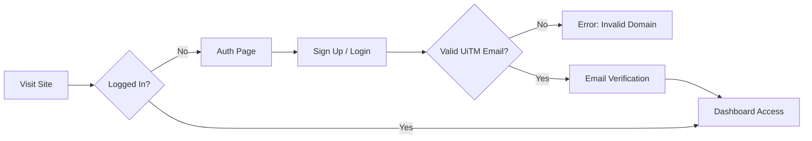
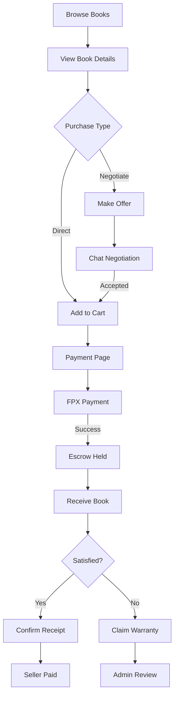
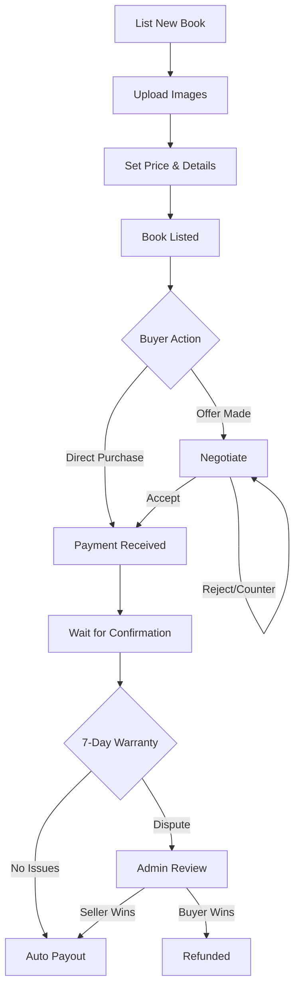
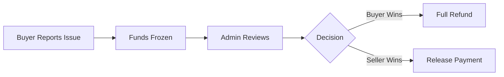

# 📚 UiTM Book e-Marketplace

> A peer-to-peer textbook marketplace platform for UiTM Tapah Campus students and staff.


---

## 📑 Table of Contents

- [Overview](#overview)
- [Features](#features)
- [Technology Stack](#technology-stack)
- [Project Structure](#project-structure)
- [System Workflows](#system-workflows)
- [Installation & Setup](#installation--setup)
- [Configuration](#configuration)
- [Usage Guide](#usage-guide)
- [Security Features](#security-features)
- [Contributing](#contributing)

---

## Overview

**UiTM Book e-Marketplace** is a web-based platform that facilitates the buying and selling of textbooks within the UiTM Tapah Campus community. The platform features a secure escrow-based payment system, real-time negotiations, warranty protection, and comprehensive admin management.

### Key Highlights

- 🔐 **UiTM-only authentication** - Restricted to `@student.uitm.edu.my` and `@staff.uitm.edu.my` domains
- 💳 **Escrow payment system** - Funds held securely until transaction completion
- 🛡️ **7-day warranty protection** - Buyer protection for quality assurance
- 💬 **Real-time negotiations** - Buyers and sellers can negotiate prices
- 📊 **Admin dashboard** - Comprehensive analytics and dispute management

---

## Features

### 🔐 Authentication & User Management

| Feature | Description |
|---------|-------------|
| **UiTM Email Restriction** | Only `@student.uitm.edu.my` and `@staff.uitm.edu.my` domains allowed |
| **Email Verification** | Users must verify email before accessing the platform |
| **Role-Based Access** | Student, Staff, and Admin roles with different permissions |
| **Remember Me** | Optional session persistence for convenience |
| **Password Reset** | Email-based password recovery |
| **Profile Management** | Edit name, phone number, upload avatar |
| **Auto-Admin Creation** | First admin auto-created with special credentials |

### 📚 Book Browsing & Search

| Feature | Description |
|---------|-------------|
| **Book Grid Display** | Visual cards with images, price, condition |
| **Real-time Search** | Search by title, author, or subject code |
| **Advanced Filters** | Filter by condition (New/Used), price range, campus location |
| **Sorting Options** | Sort by price (low/high), popularity, date added |
| **Book Details View** | Full info with image gallery, seller info |
| **View Count Tracking** | Track how many times a book is viewed |
| **Image Zoom** | Zoom into book images for detailed inspection |
| **Skeleton Loaders** | Smooth loading animations while fetching data |

### 🛒 Shopping Cart

| Feature | Description |
|---------|-------------|
| **Add to Cart** | Add multiple books from different sellers |
| **Cart Persistence** | Cart saved to database, accessible across devices |
| **Remove Items** | Remove individual items from cart |
| **Price Summary** | Subtotal, commission fee (10%), and total display |
| **Availability Check** | Prevents purchasing already-sold books |

### 💬 Negotiation System

| Feature | Description |
|---------|-------------|
| **Make Offer** | Buyers can propose their own price |
| **Real-time Chat** | Live messaging between buyer and seller |
| **Counter Offers** | Back-and-forth price negotiation |
| **Accept/Reject** | Clear actions for offer management |
| **10x Price Cap** | Offers cannot exceed 10x original price |
| **System Messages** | Automated messages for actions taken |
| **Notifications** | Instant alerts for new offers and responses |
| **Proceed to Payment** | Direct checkout after offer acceptance |

### 💳 Payment System

| Feature | Description |
|---------|-------------|
| **FPX Simulation** | Malaysian bank payment simulation |
| **Bank Selection** | Choose from multiple Malaysian banks |
| **Meeting Scheduler** | Set date/time for book handover |
| **Price Breakdown** | Clear display of base price + 10% commission |
| **Race Condition Prevention** | Validates book availability before payment |
| **Payment Success/Failure** | Clear feedback with receipt generation |

### 🛡️ Escrow & Warranty System

| Feature | Description |
|---------|-------------|
| **Escrow Hold** | Payment held for 7 days after purchase |
| **7-Day Warranty** | Buyer protection period for quality issues |
| **Confirm Receipt** | Buyer confirms satisfactory delivery |
| **Claim Warranty** | Report issues within warranty period |
| **Report Issue Modal** | Detailed issue reporting (wrong item, damaged, not received) |
| **Return Process** | Buyer sends item back, seller confirms receipt |
| **Auto-Payout** | Automatic release to seller after 7 days if no issues |
| **Funds Freezing** | Disputed funds frozen pending admin review |

### 👤 User Profile

| Feature | Description |
|---------|-------------|
| **Profile Header** | Avatar, name, email, role badge, join date |
| **Statistics Display** | Total listings, sales, purchases count |
| **My Listings Tab** | View all books currently listed |
| **Purchase History Tab** | View all purchases with timeline tracking |
| **Sales History Tab** | View all sales with payout status |
| **Negotiations Tab** | Manage active price negotiations |
| **Wallet Tab** | View balance, pending, frozen, total earned |
| **Edit Book Modal** | Edit existing book listings |
| **Delete Book** | Remove book listings |
| **Avatar Upload** | Custom profile picture via ImageBB |

### 💰 Wallet System

| Feature | Description |
|---------|-------------|
| **Available Balance** | Ready-to-withdraw earnings |
| **Pending Payout** | Funds in warranty period |
| **Frozen (Disputes)** | Funds under admin review |
| **Total Earned** | Lifetime earnings tracker |
| **Payout History** | Full history of received payouts |
| **Automatic Payouts** | System processes payouts after warranty |

### 📊 Transaction Timeline

| Feature | Description |
|---------|-------------|
| **Visual Progress** | Step-by-step transaction visualization |
| **Buyer Timeline** | Paid → Escrow → Received → Warranty → Payout |
| **Seller Timeline** | Listed → Sold → Delivered → Warranty → Paid |
| **Timestamps** | Date/time for each milestone |
| **Status Indicators** | Color-coded progress (complete/active/pending) |
| **Tooltips** | Hover info explaining each step |

### 🔔 Notification System

| Feature | Description |
|---------|-------------|
| **Real-time Notifications** | Instant updates via Firebase |
| **Bell Icon Badge** | Unread count display |
| **Dropdown Preview** | Quick view of recent notifications |
| **Notification History Page** | Full notification archive |
| **Type Icons** | Different icons for offers, purchases, disputes |
| **Mark as Read** | Individual and bulk read marking |
| **Click Navigation** | Direct link to relevant pages |
| **Delete Notifications** | Remove unwanted notifications |

### ⭐ Feedback System

| Feature | Description |
|---------|-------------|
| **Star Ratings** | 1-5 star rating system |
| **Feedback Types** | General feedback or dispute report |
| **Comment Box** | Detailed written feedback |
| **View Submitted Feedback** | Review your own feedback |
| **Dispute Escalation** | Flag issues for admin review |

### 🛠️ Admin Dashboard

| Feature | Description |
|---------|-------------|
| **Dashboard Overview** | Total users, transactions, revenue at a glance |
| **Sales Trend Chart** | Line chart of transaction volume over time |
| **Revenue Chart** | Bar chart of commission earnings |
| **Top Books Chart** | Most sold books visualization |
| **Subject Distribution** | Pie chart of book categories |
| **Transaction Success Rate** | Doughnut chart of success/failure |
| **Feedback Distribution** | Bar chart of rating distribution |
| **Dispute Metrics** | Opened vs resolved with resolution rate |
| **Offer Funnel** | Conversion tracking from offers to purchases |
| **Chart Filters** | Filter by time period (7 days, 30 days, all time) |
| **Recent Transactions** | Quick view of latest transactions |
| **User Management** | Search and view user details |
| **Feedback Review** | View all user feedback and disputes |
| **Dispute Resolution** | Refund buyer OR pay seller actions |
| **CSV Export** | Download transactions as spreadsheet |

### 🎨 UI/UX Features

| Feature | Description |
|---------|-------------|
| **Glassmorphism Design** | Modern frosted glass effects |
| **Role-Based Theming** | Purple accent for students, gold for staff |
| **Smooth Animations** | CSS transitions and micro-animations |
| **Skeleton Loaders** | Shimmer loading placeholders |
| **Toast Notifications** | Non-intrusive success/error messages |
| **Responsive Design** | Mobile-friendly layouts |
| **Loading Overlays** | Full-screen spinners for long operations |
| **Modal Dialogs** | Clean popup interfaces |
| **Welcome Messages** | Personalized greeting with role icon |

### 🔧 Developer Features

| Feature | Description |
|---------|-------------|
| **ESLint Configuration** | Code quality enforcement |
| **Utility Helpers** | Sanitization, validation, debounce functions |
| **Centralized Constants** | COMMISSION_RATE, WARRANTY_PERIOD, etc. |
| **Error Handling** | Consistent error messaging |
| **PDF Receipt Generation** | jsPDF integration for receipts |

---

## Technology Stack

| Category | Technology |
|----------|------------|
| **Frontend** | HTML5, CSS3, JavaScript (ES6+) |
| **Backend** | Firebase Realtime Database |
| **Authentication** | Firebase Authentication |
| **Hosting** | Cloudflare Pages / http-server |
| **Image Hosting** | ImageBB API |
| **Charts** | Chart.js |
| **Icons** | Font Awesome 6.4 |

---

## Project Structure

```
UITM-EMPLC_ver1/
│
├── index.html                    # Homepage - Book browsing
│
├── pages/
│   ├── admin.html               # Admin dashboard
│   ├── auth.html                # Login/Signup page
│   ├── book-details.html        # Individual book view
│   ├── cart.html                # Shopping cart
│   ├── chat.html                # Negotiation chat
│   ├── feedback.html            # Feedback form
│   ├── notification-history.html # All notifications
│   ├── payment.html             # Payment processing
│   ├── profile.html             # User profile & history
│   └── receipt.html             # Transaction receipt
│
├── assets/
│   ├── css/
│   │   ├── styles.css           # Main stylesheet
│   │   ├── animations.css       # CSS animations
│   │   ├── skeleton-loaders.css # Loading animations
│   │   ├── uitm-glassmorphism.css # Glassmorphism effects
│   │   ├── role-based-styles.css  # Student/Staff theming
│   │   ├── transaction-timeline.css # Timeline UI
│   │   └── ... (20 CSS files total)
│   │
│   ├── js/
│   │   ├── firebase-config.js   # Firebase setup & core utilities
│   │   ├── auth.js              # Authentication logic
│   │   ├── app.js               # Shared app functionality
│   │   ├── admin.js             # Admin dashboard (2500+ lines)
│   │   ├── profile.js           # Profile & wallet (1700+ lines)
│   │   ├── payment.js           # Payment processing
│   │   ├── homepage.js          # Book browsing & filters
│   │   ├── book-details.js      # Book view & edit modal
│   │   ├── cart.js              # Shopping cart
│   │   ├── chat.js              # Negotiation system
│   │   ├── notifications.js     # Notification dropdown
│   │   ├── utils.js             # Utility helpers
│   │   └── ... (21 JS files total)
│   │
│   └── images/                  # Static assets
│
├── config/
│   ├── firebase-config.json     # Firebase credentials
│   └── firebase-rules.json      # Security rules
│
├── file_md/
│   └── systemWalkthrough.md     # System documentation
│
├── .eslintrc.json               # ESLint configuration
├── package.json                 # NPM scripts
└── README.md                    # This file
```

---

## System Workflows

### 1. Authentication Flow



**Key Files:**
- `pages/auth.html` - Login/Signup UI
- `assets/js/auth.js` - Authentication logic
- `assets/js/firebase-config.js` - Firebase initialization

### 2. Buyer Purchase Flow



**Key Files:**
- `index.html` - Book browsing
- `pages/book-details.html` - Book view
- `pages/cart.html` - Shopping cart
- `pages/payment.html` - Payment processing
- `assets/js/payment.js` - Transaction logic

### 3. Seller Flow



**Key Files:**
- `assets/js/homepage.js` - Book listing modal
- `pages/profile.html` - Sales history
- `assets/js/profile.js` - Wallet & payouts

### 4. Escrow & Warranty System

```
Payment Flow:
┌─────────────────────────────────────────────────────────────┐
│                                                             │
│   BUYER PAYS  →  ESCROW HELD  →  WARRANTY PERIOD (7 Days)  │
│        │              │                   │                 │
│        │              │           ┌───────┴────────┐        │
│        │              │           │                │        │
│        │              │      No Issues        Warranty      │
│        │              │           │            Claimed      │
│        │              │           ↓                │        │
│        │              │    AUTO RELEASE       ┌────┴────┐   │
│        │              │    TO SELLER          │         │   │
│        │              │                   Refund    Seller  │
│        │              │                   Buyer     Wins    │
│                                                             │
└─────────────────────────────────────────────────────────────┘
```

**Constants (firebase-config.js):**
```javascript
COMMISSION_RATE = 0.10        // 10% platform fee
WARRANTY_PERIOD_DAYS = 7      // 7-day protection
AUTO_RELEASE_DAYS = 7         // Auto-payout after 7 days
```

### 5. Admin Dispute Resolution



**Key Files:**
- `pages/admin.html` - Admin dashboard
- `assets/js/admin.js` - Dispute resolution functions
  - `resolveDisputeForBuyer()` - Refund buyer
  - `resolveDisputeForSeller()` - Pay seller

---

## Installation & Setup

### Prerequisites
- Node.js ≥14.0.0
- npm or yarn
- Firebase project

### Quick Start

```bash
# Clone the repository
git clone https://github.com/qieyl345/UITM-EMPLC_design-ver1.git

# Navigate to project
cd UITM-EMPLC_ver1

# Install dependencies
npm install

# Start development server
npm run dev
```

### Available Scripts

```bash
npm run dev    # Start http-server on port 8080
npm run serve  # Start and open browser
npm run lint   # Run ESLint code checks
```

---

## Configuration

### Firebase Setup

1. Create a Firebase project at [console.firebase.google.com](https://console.firebase.google.com)
2. Enable **Authentication** (Email/Password)
3. Enable **Realtime Database**
4. Update `assets/js/firebase-config.js`:

```javascript
const firebaseConfig = {
    apiKey: "YOUR_API_KEY",
    authDomain: "YOUR_PROJECT.firebaseapp.com",
    databaseURL: "https://YOUR_PROJECT.firebaseio.com",
    projectId: "YOUR_PROJECT_ID",
    storageBucket: "YOUR_PROJECT.appspot.com",
    messagingSenderId: "YOUR_SENDER_ID",
    appId: "YOUR_APP_ID"
};
```

### Database Structure

```
Firebase Realtime Database
├── users/
│   └── {uid}/
│       ├── email, fullName, phoneNumber, role
│       ├── isSeller, totalSales, totalPurchases
│       └── wallet/
│           ├── balance, pending, frozenDispute, totalEarned
│           └── payoutHistory/
│
├── books/
│   └── {bookId}/
│       ├── title, author, isbn, price, condition
│       ├── subjectCode, campusLocation, description
│       ├── sellerId, sellerName, status, images[]
│       └── createdAt, updatedAt, viewCount
│
├── transactions/
│   └── {transactionId}/
│       ├── buyerId, status, amount, basePrice, commissionFee
│       ├── items[], meetingDate, paymentMethod
│       ├── escrowHeldAt, actualDeliveryDate, warrantyExpiresAt
│       └── sellerPaidOut, sellerPayoutAmount
│
├── offers/
│   └── {offerId}/
│       ├── bookId, buyerId, sellerId
│       ├── bookPrice, currentPrice, status
│       └── lastActionBy, createdAt, updatedAt
│
├── chats/
│   └── {offerId}/
│       ├── participants, lastMessage
│       └── messages/
│
├── feedback/
│   └── {feedbackId}/
│       ├── userId, transactionId, rating, type
│       ├── comment, status, createdAt
│
├── notifications/
│   └── {notificationId}/
│       ├── recipientId, type, message, read
│       └── offerId, bookId, createdAt
│
└── carts/
    └── {userId}/
        └── items/
```

---

## Usage Guide

### User Roles

| Role | Access | Domain |
|------|--------|--------|
| **Student** | Buy, Sell, Negotiate | @student.uitm.edu.my |
| **Staff** | Buy, Sell, Negotiate | @staff.uitm.edu.my |
| **Admin** | Full Dashboard Access | Special credentials |

### Transaction Statuses

| Status | Description |
|--------|-------------|
| `pending_payment` | Awaiting payment |
| `payment_held` | Escrow active, awaiting delivery |
| `delivered` | Buyer confirmed receipt |
| `completed` | Transaction finished, seller paid |
| `warranty_claimed` | Buyer filed warranty claim |
| `return_sent` | Buyer sent item back |
| `return_received` | Seller received returned item |
| `refunded` | Buyer refunded |
| `dispute_open` | Under admin review |
| `failed` | Transaction failed |

---

## Security Features

### Authentication
- Firebase Authentication with email verification
- UiTM email domain restriction
- Session management with optional persistence

### Database Security
- Role-based access control via Firebase rules
- Users can only modify their own data
- Admin-only access for sensitive operations

### Client-Side Protection
- Input sanitization via `escapeHtml()` utility
- Form validation helpers
- XSS prevention patterns

### Financial Security
- Escrow-based payment protection
- 7-day warranty period
- Dispute resolution system
- Commission deduction at payout

---

## Core Utilities

### firebase-config.js

```javascript
// Key Functions
waitForAuth()           // Wait for Firebase auth initialization
isAdmin()               // Check if current user is admin
formatCurrency(amount)  // Format as "RM X.XX"
formatDate(timestamp)   // Format date string
showNotification(msg, type)  // Display toast notification
checkAndProcessAutoPayouts() // Process automatic payouts
```

### utils.js

```javascript
// Sanitization
escapeHtml(text)        // Prevent XSS attacks
safeSetText(el, text)   // Safe text content setter

// Performance
debounce(fn, delay)     // Debounce function calls
throttle(fn, limit)     // Throttle function calls

// Validation
isValidEmail(email)     // Email format check
isValidUitmEmail(email) // UiTM domain check
isValidPrice(value)     // Price validation
handleError(error, msg) // Consistent error handling

// UX
showSkeletonLoader(container, type, count)
```

---

## Contributing

1. Fork the repository
2. Create a feature branch: `git checkout -b feature/NewFeature`
3. Commit changes: `git commit -m "Add NewFeature"`
4. Push to branch: `git push origin feature/NewFeature`
5. Submit a Pull Request

### Code Style
- Run `npm run lint` before committing
- Follow existing patterns in codebase
- Use ES6+ JavaScript features

---

## License

This project is licensed under the ISC License.

---

## Acknowledgments

- **UiTM Tapah Campus** - Project context
- **Firebase** - Backend infrastructure
- **ImageBB** - Image hosting
- **Chart.js** - Dashboard analytics
- **Font Awesome** - Icons

---

<p align="center">
  <strong>UiTM Book e-Marketplace</strong><br>
  Built with ❤️ for UiTM Tapah Campus
</p>
