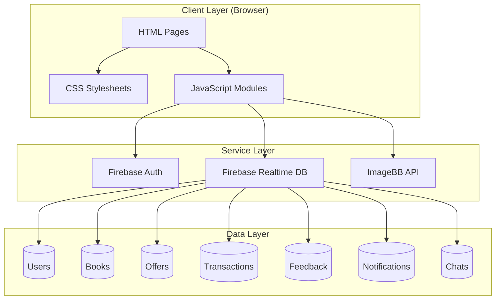
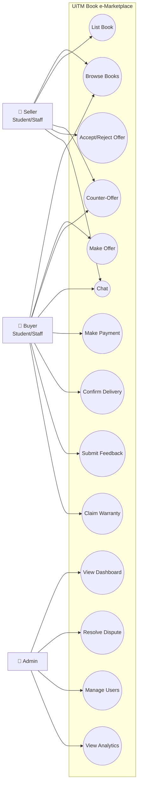
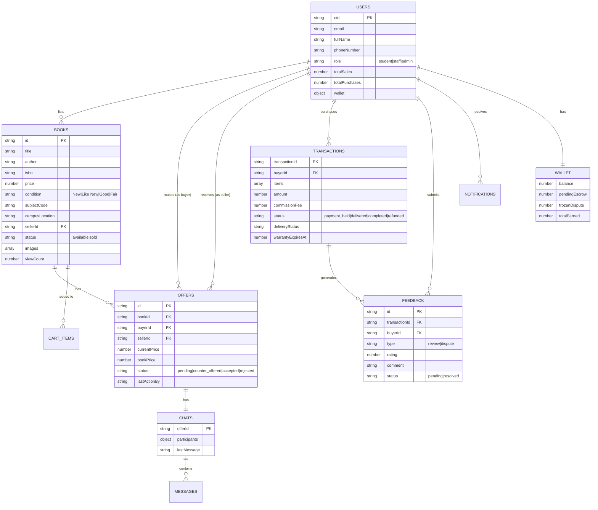
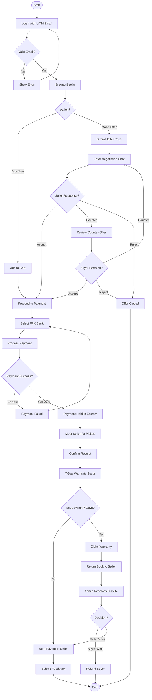
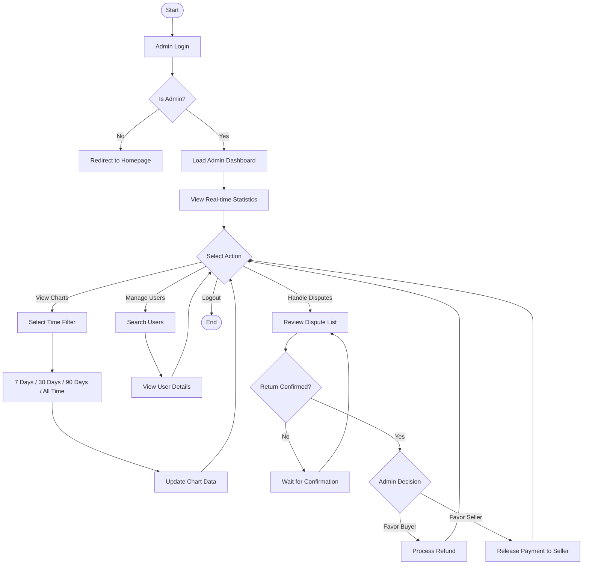
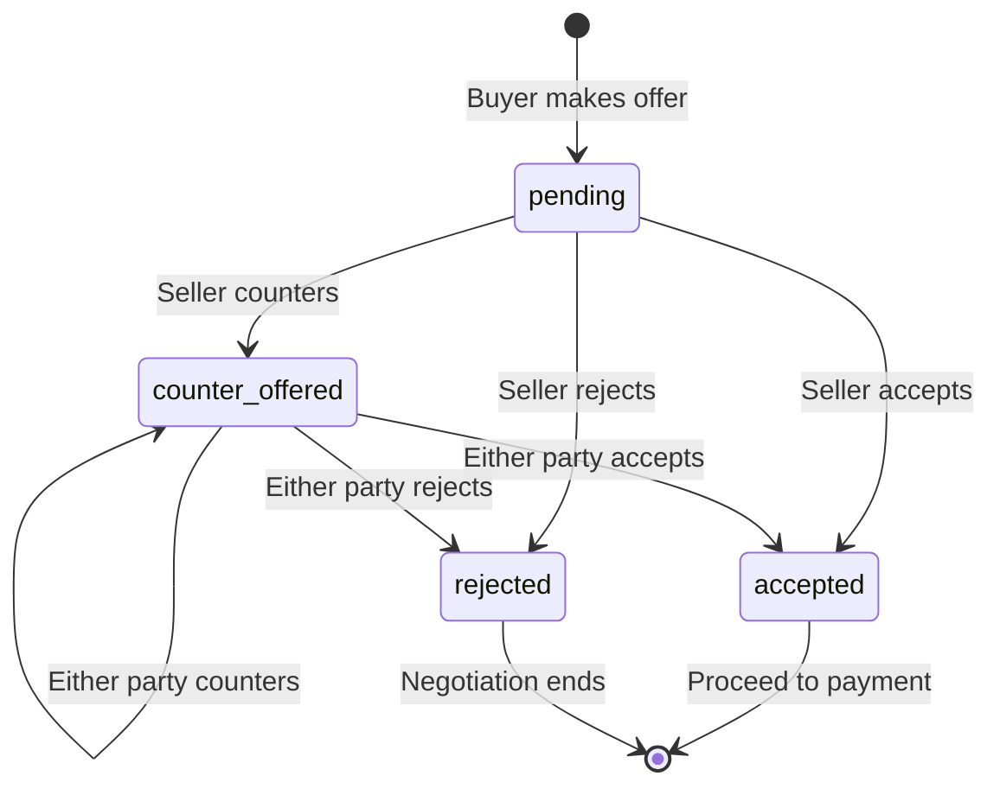

# CHAPTER 4: SYSTEM IMPLEMENTATION AND DESIGN

## 4.1 Introduction

This chapter documents the implementation of the **UiTM Book e-Marketplace**, a consumer-to-consumer (C2C) platform designed to facilitate used textbook trading among UiTM students and staff. The development follows the **Web Application Development Life Cycle (WADLC)** methodology, ensuring a structured approach from planning through deployment.

### 4.1.1 Development Methodology: WADLC

The project adheres to the WADLC phases:

| Phase | Activities |
|-------|-----------|
| **Planning** | Requirements gathering, stakeholder analysis, scope definition |
| **Analysis** | User research, feature prioritization, data modeling |
| **Design** | UI/UX design, database schema, system architecture |
| **Development** | Frontend coding, Firebase integration, feature implementation |
| **Testing** | Functional testing, usability testing, security validation |
| **Deployment** | Static hosting, Firebase rules deployment |

### 4.1.2 Technology Stack

The platform was built using modern web technologies without relying on legacy frameworks:

| Component | Technology | Justification |
|-----------|------------|---------------|
| **Frontend** | Vanilla HTML5, CSS3, JavaScript (ES6+) | Lightweight, no framework overhead, faster load times |
| **Backend** | Firebase Realtime Database | Real-time sync, built-in authentication, scalable |
| **Authentication** | Firebase Auth | Secure, supports email/password, easy integration |
| **Image Hosting** | ImageBB API | Free tier, reliable CDN, simple API |
| **Charts** | Chart.js v4.4.1 | Interactive, responsive, 8 chart types used |
| **Design** | Custom CSS with Glassmorphism | Modern aesthetic, UiTM branding colors |

---

## 4.2 System Architecture Overview

### 4.2.1 Client-Server Architecture

The system employs a **client-server model** with Firebase acting as a Backend-as-a-Service (BaaS):



### 4.2.2 MVC-Inspired Structure

Although built without a backend framework, the codebase follows an **MVC-inspired pattern**:

| Layer | Implementation | Files |
|-------|----------------|-------|
| **Model** | Firebase data operations, validation logic | `firebase-config.js`, `app.js` |
| **View** | HTML templates, CSS styling | `index.html`, `pages/*.html`, `assets/css/*.css` |
| **Controller** | Event handlers, business logic | `auth.js`, `homepage.js`, `book-details.js`, `chat.js`, `payment.js`, `admin.js` |

### 4.2.3 Project Directory Structure

```
UITM-EMPLC_ver1/
├── index.html                 # Homepage (book browsing)
├── launch.html                # Landing page
├── pages/
│   ├── login.html             # User authentication
│   ├── signup.html            # User registration
│   ├── book-details.html      # Individual book view
│   ├── cart.html              # Shopping cart
│   ├── payment.html           # FPX payment simulation
│   ├── receipt.html           # Transaction receipt
│   ├── chat.html              # Offer negotiation room
│   ├── profile.html           # User dashboard
│   ├── admin.html             # Admin analytics dashboard
│   ├── notifications.html     # Notification history
│   └── feedback.html          # Post-purchase feedback
├── assets/
│   ├── css/                   # 19 stylesheet files
│   │   ├── styles.css         # Main styles (83KB)
│   │   ├── admin-notifications.css
│   │   ├── animations.css
│   │   └── ...
│   ├── js/                    # 21 JavaScript modules
│   │   ├── firebase-config.js # Firebase setup & utilities
│   │   ├── auth.js            # Authentication logic
│   │   ├── admin.js           # Admin dashboard (94KB)
│   │   └── ...
│   └── images/                # Static assets
└── config/
    ├── firebase-rules.json    # Database security rules
    └── presentation-dummy-data.json
```

---

## 4.3 Project Design Artifacts

### 4.3.1 Use Case Diagram (UCD)

The system supports three distinct user roles with specific capabilities:



**Key Use Cases by Role:**

| Role | Core Actions |
|------|-------------|
| **Buyer** | Browse books, Make offer, Chat, Pay, Confirm delivery, Submit feedback, Claim warranty |
| **Seller** | List book, Counter-offer, Accept/Reject, Chat |
| **Admin** | View dashboard, Resolve disputes, Manage users, View analytics charts |

---

### 4.3.2 Entity Relationship Diagram (ERD)

The Firebase Realtime Database stores data in the following structure:



**Key Relationships:**
- **One-to-Many**: One seller → Many books, One user → Many transactions
- **One-to-One**: One offer → One chat room, One user → One wallet
- **Many-to-Many** (via junction): Users participate in multiple offers as buyer/seller

---

### 4.3.3 System Flowchart

#### User Flow: Complete Purchase Journey



#### Admin Flow: Dashboard Operations



---

## 4.4 Core Module Implementation

### 4.4.1 User Authentication

#### Email Domain Validation

The system restricts registration to UiTM email domains only:

**File:** `assets/js/auth.js` (Lines 3-35)

```javascript
// Sign up function
async function signUp(email, password, fullName, phoneNumber, role) {
    // Validate UiTM email domain
    const validDomains = ['@student.uitm.edu.my', '@staff.uitm.edu.my'];
    const isValidDomain = validDomains.some(domain => email.endsWith(domain));
    
    if (!isValidDomain) {
        throw new Error('Only UiTM email addresses are allowed');
    }
    
    // Firebase authentication
    const userCredential = await auth.createUserWithEmailAndPassword(email, password);
    const user = userCredential.user;
    
    // Create user profile in database
    await database.ref('users/' + user.uid).set({
        email: email,
        fullName: fullName,
        phoneNumber: phoneNumber,
        role: role, // 'student' or 'staff'
        createdAt: Date.now(),
        totalSales: 0,
        totalPurchases: 0,
        wallet: { balance: 0, pendingEscrow: 0, totalEarned: 0 }
    });
    
    return user;
}
```

#### Auto-Create Admin Account

**File:** `assets/js/auth.js` (Lines 185-206)

```javascript
// Auto-create admin account if credentials match
if (isAdminLogin && password === 'admin123') {
    try {
        console.log("Auto-creating admin account...");
        const userCredential = await auth.createUserWithEmailAndPassword(
            'admin@student.uitm.edu.my', 
            'admin123'
        );
        
        await database.ref('users/' + userCredential.user.uid).set({
            email: 'admin@student.uitm.edu.my',
            fullName: 'System Administrator',
            role: 'admin',
            createdAt: Date.now()
        });
        
        showNotification("Admin account created! Logging in...", "success");
    } catch (signupError) {
        // Handle if already exists
    }
}
```

> **📸 Screenshot Required:** Capture the login page showing the ID input field  
> **Location:** `file_md/screenshots/4.4.1_login_page.png`

---

### 4.4.2 Book Listing & Search

#### Image Upload via ImageBB

**File:** `assets/js/app.js` (Lines 455-478)

```javascript
// Image upload to ImageBB
async function uploadImageToImgBB(imageFile) {
    const IMGBB_API_KEY = 'a89c0e195a0ed4526e28c229ce99f921';
    
    const formData = new FormData();
    formData.append('image', imageFile);
    
    const response = await fetch(
        `https://api.imgbb.com/1/upload?key=${IMGBB_API_KEY}`,
        { method: 'POST', body: formData }
    );
    
    const data = await response.json();
    
    if (!data.success) {
        throw new Error('Image upload failed');
    }
    
    return data.data.url; // Returns CDN URL
}
```

#### Real-Time Search & Filtering

**File:** `assets/js/homepage.js` (Lines 96-152)

```javascript
function applyFilters() {
    const searchTerm = document.getElementById('searchInput').value.toLowerCase();
    const condition = document.getElementById('conditionFilter').value;
    const minPrice = parseFloat(document.getElementById('minPrice').value) || 0;
    const maxPrice = parseFloat(document.getElementById('maxPrice').value) || Infinity;
    const campus = document.getElementById('campusFilter').value;
    
    filteredBooks = allBooks.filter(book => {
        // Status check - only show available books
        if (book.status === 'sold') return false;
        
        // Search match
        const searchMatch = book.title.toLowerCase().includes(searchTerm) ||
                           book.author.toLowerCase().includes(searchTerm) ||
                           book.subjectCode.toLowerCase().includes(searchTerm);
        
        // Condition filter
        const conditionMatch = !condition || book.condition === condition;
        
        // Price range
        const priceMatch = book.price >= minPrice && book.price <= maxPrice;
        
        // Campus filter
        const campusMatch = !campus || book.campusLocation === campus;
        
        return searchMatch && conditionMatch && priceMatch && campusMatch;
    });
    
    displayBooks();
}
```

> **📸 Screenshot Required:** Capture the homepage with filter sidebar visible  
> **Location:** `file_md/screenshots/4.4.2_book_listing.png`

---

### 4.4.3 Offer & Negotiation System

#### Offer Creation with Validation

**File:** `assets/js/book-details.js` (Lines 187-263)

```javascript
document.getElementById('offerForm').addEventListener('submit', async (e) => {
    e.preventDefault();
    const offerPrice = parseFloat(document.getElementById('offerPrice').value);
    
    // Validation
    if (isNaN(offerPrice) || offerPrice <= 0) {
        showNotification("Please enter a valid price", "error");
        return;
    }
    
    const offerData = {
        bookId: currentBook.id,
        bookTitle: currentBook.title,
        bookPrice: currentBook.price,
        buyerId: currentUser.uid,
        buyerName: userData.fullName,
        sellerId: currentBook.sellerId,
        sellerName: currentBook.sellerName,
        currentPrice: offerPrice,
        status: 'pending',
        lastActionBy: currentUser.uid,
        createdAt: Date.now()
    };
    
    // Create offer in Firebase
    const offerRef = await database.ref('offers').push(offerData);
    
    // Initialize chat room
    await database.ref(`chats/${offerRef.key}`).set({
        participants: { [currentUser.uid]: true, [currentBook.sellerId]: true },
        lastMessage: `Offer made: RM ${offerPrice.toFixed(2)}`,
        lastMessageTimestamp: Date.now()
    });
    
    // Notify seller
    await database.ref('notifications').push({
        recipientId: currentBook.sellerId,
        type: 'offer',
        message: `${userData.fullName} offered RM ${offerPrice.toFixed(2)} for "${currentBook.title}"`,
        read: false,
        createdAt: Date.now()
    });
});
```

#### Counter-Offer Validation Rules

**File:** `assets/js/chat.js` (Lines 352-404)

```javascript
form.addEventListener('submit', async (e) => {
    e.preventDefault();
    const price = parseFloat(priceInput.value);
    
    // Validation 1: Price must be positive
    if (isNaN(price) || price <= 0) {
        priceError.textContent = 'Please enter a valid price greater than RM 0.00';
        priceError.style.display = 'block';
        return;
    }
    
    // Validation 2: Cannot exceed 10x original price
    const maxPrice = currentOffer.bookPrice * 10;
    if (price > maxPrice) {
        priceError.textContent = `Price cannot exceed ${formatCurrency(maxPrice)} (10x original)`;
        priceError.style.display = 'block';
        return;
    }
    
    // Validation 3: Must differ by at least RM 0.50
    const priceDiff = Math.abs(price - currentOffer.currentPrice);
    if (priceDiff < 0.50) {
        priceError.textContent = 'Counter-offer must differ by at least RM 0.50';
        priceError.style.display = 'block';
        return;
    }
    
    // Update offer
    await database.ref(`offers/${currentOfferId}`).update({
        currentPrice: price,
        status: 'counter_offered',
        lastActionBy: currentUser.uid,
        updatedAt: Date.now()
    });
});
```

#### Chat Rate-Limiting

**File:** `assets/js/chat.js` (Lines 6-7, 238-243)

```javascript
const MESSAGE_COOLDOWN = 2000; // 2 seconds between messages

// Rate limiting check
const now = Date.now();
if (now - lastMessageTime < MESSAGE_COOLDOWN) {
    const remaining = Math.ceil((MESSAGE_COOLDOWN - (now - lastMessageTime)) / 1000);
    showNotification(`Please wait ${remaining} second(s)`, "warning");
    return;
}
```

**Offer Status Flow:**



> **📸 Screenshot Required:** Capture the negotiation chat interface  
> **Location:** `file_md/screenshots/4.4.3_chat_interface.png`

---

### 4.4.4 Shopping Cart & Simulated Payment

#### FPX Payment Simulation

**File:** `assets/js/payment.js` (Lines 133-210)

```javascript
async function processPayment() {
    // Validate book availability before payment
    const { unavailableBooks, availableItems } = await validateBookAvailability();
    
    if (unavailableBooks.length > 0) {
        showNotification(`Books no longer available: ${unavailableBooks.join(', ')}`, "error");
        return;
    }
    
    // Show processing modal
    document.getElementById('processingModal').style.display = 'flex';
    
    // Simulate FPX processing delay (3 seconds)
    await new Promise(resolve => setTimeout(resolve, 3000));
    
    // 90% success rate simulation
    const isSuccess = Math.random() < 0.9;
    
    if (isSuccess) {
        const transactionId = await completeTransaction();
        showPaymentSuccess(transactionId);
    } else {
        // Record failed transaction for analytics
        await database.ref(`transactions/${failedTransactionId}`).set({
            status: 'failed',
            failureReason: 'FPX payment processing failed',
            createdAt: Date.now()
        });
        showPaymentFailure();
    }
}
```

#### Escrow System Implementation

**File:** `assets/js/payment.js` (Lines 212-320)

```javascript
async function completeTransaction() {
    const transactionId = 'TXN' + Date.now();
    
    // Calculate amounts
    const subtotal = paymentItems.reduce((sum, item) => sum + item.bookDetails.price, 0);
    const commission = subtotal * COMMISSION_RATE; // 10%
    const total = subtotal + commission;
    
    // Create transaction with ESCROW status
    const transaction = {
        transactionId,
        buyerId: currentUser.uid,
        items: paymentItems,
        amount: total,
        commissionFee: commission,
        status: 'payment_held',  // ESCROW: Money held until confirmed
        escrowHeldAt: Date.now(),
        autoReleaseAt: Date.now() + (7 * 24 * 60 * 60 * 1000), // 7 days
        sellerPaidOut: false
    };
    
    await database.ref(`transactions/${transactionId}`).set(transaction);
    
    // Mark book as sold
    await database.ref(`books/${item.bookDetails.id}`).update({
        status: 'sold',
        soldAt: Date.now()
    });
    
    // Add to seller's PENDING escrow (not withdrawable)
    await database.ref(`users/${sellerId}/wallet`).update({
        pendingEscrow: currentPendingEscrow + itemPrice
    });
    
    return transactionId;
}
```

> **📸 Screenshot Required:** Capture the payment page with bank selection  
> **Location:** `file_md/screenshots/4.4.4_payment_page.png`

---

### 4.4.5 Admin Dashboard with Chart.js

#### 8 Interactive Charts

**File:** `assets/js/admin.js` (Lines 7-15)

```javascript
// Chart instances for dynamic updates
let salesChartInstance = null;
let revenueChartInstance = null;
let disputeMetricsChartInstance = null;
let topBooksChartInstance = null;
let subjectChartInstance = null;
let transactionSuccessChartInstance = null;
let feedbackDistributionChartInstance = null;
let offerFunnelChartInstance = null;
```

**Chart Types and Purposes:**

| Chart | Type | Purpose |
|-------|------|---------|
| Sales Trend | Line | Track transaction volume over time |
| Revenue | Bar | Monitor commission earnings |
| Dispute Metrics | Bar | Analyze dispute patterns |
| Top Books | Horizontal Bar | Identify best-selling titles |
| Subject Distribution | Pie | Analyze book categories |
| Transaction Success | Doughnut | Success vs. failure rate |
| Feedback Distribution | Bar | Rating distribution |
| Offer Funnel | Bar | Offer → Accept conversion |

#### Time Filter Implementation

**File:** `assets/js/admin.js` (Lines 1329-1393)

```javascript
function setupChartFilters() {
    // Sales chart filter
    const salesFilter = document.getElementById('salesFilter');
    if (salesFilter) {
        salesFilter.addEventListener('change', (e) => {
            updateSalesChart(e.target.value);
        });
    }
    
    // Revenue chart filter
    const revenueFilter = document.getElementById('revenueFilter');
    if (revenueFilter) {
        revenueFilter.addEventListener('change', (e) => {
            updateRevenueChart(e.target.value);
        });
    }
    
    // Dispute metrics filter
    const disputeFilter = document.getElementById('disputeFilter');
    if (disputeFilter) {
        disputeFilter.addEventListener('change', (e) => {
            updateDisputeMetricsChart(e.target.value);
        });
    }
}

function calculateSalesTrendWithFilter(range) {
    let days, labels = [], data = [];
    
    switch(range) {
        case '7': days = 7; break;
        case '30': days = 30; break;
        case '90': days = 90; break;
        default: return calculateAllTimeSalesTrend();
    }
    
    for (let i = days - 1; i >= 0; i--) {
        const date = new Date();
        date.setDate(date.getDate() - i);
        labels.push(date.toLocaleDateString('en-MY', { month: 'short', day: 'numeric' }));
        
        const count = allTransactions.filter(txn => {
            const txnDate = new Date(txn.createdAt);
            return txnDate.toDateString() === date.toDateString();
        }).length;
        
        data.push(count);
    }
    
    return { labels, data };
}
```

> **📸 Screenshot Required:** Capture the admin dashboard with all charts visible  
> **Location:** `file_md/screenshots/4.4.5_admin_dashboard.png`

---

## 4.5 Security & Data Integrity

### 4.5.1 Firebase Security Rules

**File:** `config/firebase-rules.json`

```json
{
  "rules": {
    "users": {
      ".read": "auth != null",
      "$uid": {
        ".write": "auth != null && (auth.uid == $uid || 
                  root.child('users/' + auth.uid + '/role').val() == 'admin')"
      }
    },
    "books": {
      "$bookId": {
        ".write": "auth != null && (
          !data.exists() || 
          data.child('sellerId').val() == auth.uid || 
          root.child('users/' + auth.uid + '/role').val() == 'admin' ||
          (newData.child('status').val() == 'sold' && data.child('status').val() == 'available')
        )"
      }
    },
    "offers": {
      "$offerId": {
        ".read": "auth != null && (
          data.child('buyerId').val() == auth.uid || 
          data.child('sellerId').val() == auth.uid ||
          root.child('users/' + auth.uid + '/role').val() == 'admin'
        )"
      }
    },
    "chats": {
      "$offerId": {
        ".read": "auth != null && (
          root.child('offers/' + $offerId + '/buyerId').val() == auth.uid || 
          root.child('offers/' + $offerId + '/sellerId').val() == auth.uid
        )"
      }
    },
    "feedback": {
      ".read": "auth != null && 
               root.child('users/' + auth.uid + '/role').val() == 'admin'"
    }
  }
}
```

### 4.5.2 Security Measures Summary

| Security Feature | Implementation |
|-----------------|----------------|
| **Email Domain Restriction** | Only `@student.uitm.edu.my` and `@staff.uitm.edu.my` allowed |
| **Role-Based Access** | Admin dashboard blocked for non-admin users |
| **Data Ownership** | Only book owner can edit/delete their listings |
| **Chat Privacy** | Only buyer and seller in an offer can access chat |
| **Feedback Privacy** | Only admins can view all feedback; users see their own |
| **Escrow Protection** | Funds held until buyer confirms delivery |
| **Auto-Dispute** | System flags unconfirmed deliveries after 7 days |

### 4.5.3 Warranty & Dispute Flow

**File:** `assets/js/profile.js` (Lines 1274-1306)

```javascript
// Claim warranty - buyer reports issue within 7 days of receiving book
async function claimWarranty(transactionId) {
    const txnSnapshot = await database.ref(`transactions/${transactionId}`).once('value');
    const txn = txnSnapshot.val();
    
    // Verify warranty period
    const warrantyExpiry = txn.deliveredAt + WARRANTY_PERIOD_MS;
    if (Date.now() > warrantyExpiry) {
        showNotification('Warranty period has expired (7 days)', 'error');
        return;
    }
    
    // Move escrow to frozen state
    await database.ref(`users/${sellerId}/wallet`).update({
        pendingEscrow: wallet.pendingEscrow - itemPrice,
        frozenDispute: (wallet.frozenDispute || 0) + itemPrice
    });
    
    // Update transaction status
    await database.ref(`transactions/${transactionId}`).update({
        status: 'warranty_claimed',
        warrantyClaim: { claimedAt: Date.now(), reason: 'Buyer reported issue' }
    });
    
    // Notify admin
    await database.ref('notifications').push({
        recipientId: 'admin',
        type: 'dispute',
        message: `Warranty claim on transaction ${transactionId}`
    });
}
```

---

## 4.6 Summary

This chapter has demonstrated the complete implementation of the **UiTM Book e-Marketplace**:

### Key Achievements:

| Aspect | Details |
|--------|---------|
| **Architecture** | Client-server model with Firebase BaaS |
| **Technology** | Vanilla JS, Firebase, Chart.js, ImageBB |
| **Features** | 12 HTML pages, 21 JS modules, 19 CSS files |
| **Security** | Role-based access, escrow system, data validation |
| **Innovation** | Real-time negotiation, 8 analytics charts, warranty system |

### Design Artifacts Delivered:
- ✅ Use Case Diagram (UCD) reflecting all three roles
- ✅ Entity Relationship Diagram (ERD) with 7 entities
- ✅ System Flowchart for user and admin journeys

### Technical Highlights:
- **No Framework Overhead**: Pure vanilla JavaScript for optimal performance
- **Real-Time Updates**: Firebase listeners for instant data synchronization
- **Responsive Design**: Mobile-friendly interface with glassmorphism aesthetics
- **Secure by Default**: Firebase security rules enforce data protection

---

## 📸 Screenshot Checklist for Chapter 4

Please capture the following screenshots and place them in `file_md/screenshots/`:

| Screenshot | Description | Filename |
|------------|-------------|----------|
| Login Page | Main login interface with ID input | `4.4.1_login_page.png` |
| Homepage | Book listing with filter sidebar | `4.4.2_book_listing.png` |
| Chat Interface | Negotiation room with messages | `4.4.3_chat_interface.png` |
| Payment Page | FPX bank selection screen | `4.4.4_payment_page.png` |
| Admin Dashboard | Full dashboard with charts | `4.4.5_admin_dashboard.png` |

---

*End of Chapter 4*
