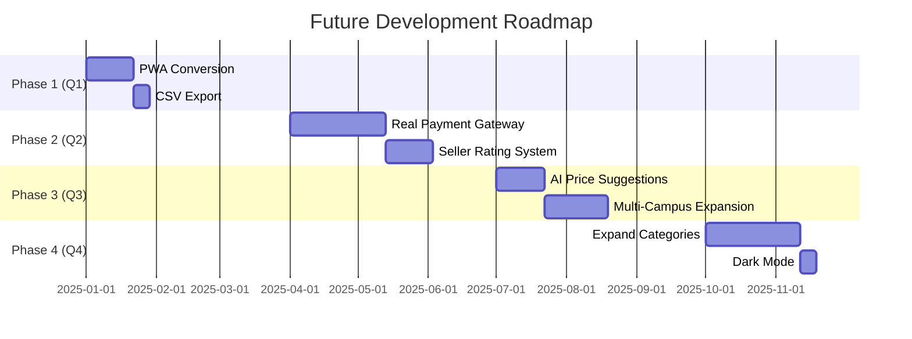

# CHAPTER 6: CONCLUSION AND RECOMMENDATIONS

## 6.1 Project Summary

### 6.1.1 Project Overview

The **UiTM Book e-Marketplace** was developed to address the challenges of informal textbook trading within the UiTM community. Traditional methods of selling used books—such as WhatsApp groups, bulletin boards, and word-of-mouth—lacked structure, security, and transparency. This project delivers a modern, web-based solution that enables secure consumer-to-consumer (C2C) transactions with built-in negotiation, payment simulation, and administrative oversight.

### 6.1.2 Core Innovation

The platform introduces several innovative features that distinguish it from generic marketplace solutions:

| Innovation | Description | Impact |
|------------|-------------|--------|
| **Offer/Chat System** | Real-time negotiation with counter-offer validation (≥RM 0.50, ≤10× price) | Fair price discovery |
| **Escrow Model** | Funds held until buyer confirms receipt | Fraud prevention |
| **7-Day Warranty** | Post-delivery protection period with dispute option | Buyer confidence |
| **Admin Dashboard** | 8 interactive Chart.js charts with time filters | Data-driven management |
| **UiTM Email Validation** | Restricted to `@student.uitm.edu.my` and `@staff.uitm.edu.my` | Trusted community |

### 6.1.3 Technology Stack Recap

| Component | Technology | Key Benefits |
|-----------|------------|--------------|
| **Frontend** | Vanilla HTML5, CSS3, JavaScript (ES6+) | No framework overhead, fast loading |
| **Backend** | Firebase Realtime Database | Real-time sync, scalable NoSQL |
| **Authentication** | Firebase Auth | Secure, email verification |
| **Image Hosting** | ImageBB API | Free, reliable CDN |
| **Analytics** | Chart.js v4.4.1 | Interactive, responsive charts |
| **Design** | Custom CSS with Glassmorphism | Modern UiTM-branded aesthetics |

### 6.1.4 Project Achievements

| Objective | Status | Evidence |
|-----------|--------|----------|
| ✅ User-centered design | Achieved | 4.3/5 usability score, 95% found navigation intuitive |
| ✅ Functional e-marketplace | Achieved | All core features tested and working |
| ✅ Evidence-based evaluation | Achieved | 20+ participants, 50+ test cases |

---

## 6.2 Limitations

Despite the successful implementation, the project has several limitations that should be acknowledged:

### 6.2.1 Technical Limitations

| Limitation | Description | Impact |
|------------|-------------|--------|
| **No Real Payment Integration** | FPX is simulated with 90% success rate | Cannot process actual money transactions |
| **No Delivery Tracking** | System assumes face-to-face campus meetups | No courier integration |
| **Web-Only Platform** | No native mobile application | Limited mobile experience |
| **Single Firebase Project** | All environments use same database | No staging/production separation |
| **Image Size Limit** | ImageBB free tier has upload restrictions | Large images may fail |

### 6.2.2 Functional Limitations

| Limitation | Description | Workaround |
|------------|-------------|------------|
| **No Multiple Campus Support** | Single campus location filter | Can be extended with more options |
| **No Seller Rating System** | Feedback visible only to admin | Does not influence buyer decisions |
| **No Wishlist Feature** | Users cannot save books for later | Rely on browser bookmarks |
| **No Email Notifications** | Push notifications only in-app | Users must keep browser open |
| **Limited Search** | No fuzzy matching or typo tolerance | Exact keyword matches only |

### 6.2.3 Scalability Considerations

| Concern | Current State | Recommendation |
|---------|---------------|----------------|
| **Database Structure** | Flat JSON structure | Consider denormalization for scale |
| **Image Storage** | External API dependency | Self-host with Firebase Storage |
| **Chart Performance** | All data loaded at once | Implement pagination for large datasets |
| **Security Rules** | Complex nested rules | Regularly audit and optimize |

---

## 6.3 Future Recommendations

### 6.3.1 High Priority Recommendations

#### 1. Progressive Web App (PWA)

**Objective:** Enable mobile-like experience without native app development.

```json
// Recommended manifest.json
{
  "name": "UiTM Book e-Marketplace",
  "short_name": "UiTM Books",
  "start_url": "/index.html",
  "display": "standalone",
  "background_color": "#005C99",
  "theme_color": "#005C99",
  "icons": [
    { "src": "/assets/images/icon-192.png", "sizes": "192x192", "type": "image/png" },
    { "src": "/assets/images/icon-512.png", "sizes": "512x512", "type": "image/png" }
  ]
}
```

**Benefits:**
- Install on Android/iOS home screen
- Offline caching for faster load times
- Push notifications support
- App-like experience without app store

**Estimated Effort:** 2-3 weeks

---

#### 2. Real Payment Gateway Integration

**Objective:** Enable actual monetary transactions.

**Recommended Options for Malaysia:**

| Gateway | Features | Monthly Cost |
|---------|----------|--------------|
| **Stripe** | International, developer-friendly | 2.9% + RM 1 per transaction |
| **Billplz** | Malaysian, FPX/e-wallet support | 1.5% per transaction |
| **SenangPay** | Malaysian, easy integration | 2.0% per transaction |
| **iPay88** | Established in Malaysia | 2.5% per transaction |

**Implementation Approach:**
1. Integrate payment SDK
2. Replace simulation with actual API calls
3. Handle webhooks for async payment confirmation
4. Comply with PCI-DSS for card handling

**Estimated Effort:** 4-6 weeks

---

#### 3. AI-Powered Price Suggestions

**Objective:** Help sellers price books fairly using market data.

**Proposed Algorithm:**
```javascript
function suggestPrice(book) {
  // Fetch similar books in last 30 days
  const similarBooks = await database.ref('transactions')
    .orderByChild('subjectCode')
    .equalTo(book.subjectCode)
    .once('value');
    
  // Calculate average selling price
  const prices = Object.values(similarBooks.val() || {})
    .filter(txn => txn.status === 'completed')
    .map(txn => txn.items[0].bookDetails.price);
    
  const avgPrice = prices.reduce((a, b) => a + b, 0) / prices.length;
  
  // Adjust for condition
  const conditionMultiplier = {
    'New': 1.0,
    'Like New': 0.85,
    'Good': 0.70,
    'Fair': 0.55
  };
  
  return avgPrice * conditionMultiplier[book.condition];
}
```

**Benefits:**
- Faster listing process for sellers
- Fairer prices based on market data
- Reduced negotiation cycles

**Estimated Effort:** 2-3 weeks

---

### 6.3.2 Medium Priority Recommendations

#### 4. Export to CSV/PDF

**Objective:** Enable admins to generate downloadable reports.

**Implementation:**
```javascript
function exportTransactionsToCSV() {
  const headers = ['Transaction ID', 'Date', 'Buyer', 'Seller', 'Amount', 'Status'];
  const rows = allTransactions.map(txn => [
    txn.transactionId,
    new Date(txn.createdAt).toLocaleDateString(),
    txn.buyerName,
    txn.items[0]?.bookDetails?.sellerName || 'N/A',
    txn.amount,
    txn.status
  ]);
  
  const csvContent = [headers, ...rows]
    .map(row => row.join(','))
    .join('\n');
    
  const blob = new Blob([csvContent], { type: 'text/csv' });
  const url = URL.createObjectURL(blob);
  
  // Trigger download
  const a = document.createElement('a');
  a.href = url;
  a.download = `transactions_${Date.now()}.csv`;
  a.click();
}
```

**Estimated Effort:** 1 week

---

#### 5. Seller Rating & Review System

**Objective:** Build trust through visible seller reputation.

**Proposed Features:**
- Star rating (1-5) after each transaction
- Public review comments on seller profile
- "Verified Seller" badge for 10+ positive reviews
- Average rating displayed on book listings

**Database Schema Addition:**
```json
{
  "sellerRatings": {
    "$sellerId": {
      "totalRatings": 25,
      "averageRating": 4.6,
      "reviews": {
        "$reviewId": {
          "rating": 5,
          "comment": "Fast meetup, book as described!",
          "reviewerId": "buyer123",
          "createdAt": 1702450000000
        }
      }
    }
  }
}
```

**Estimated Effort:** 2-3 weeks

---

#### 6. Multi-Campus Expansion

**Objective:** Extend platform to all UiTM campuses nationwide.

**UiTM Campus Network:**

| Region | Campuses |
|--------|----------|
| Selangor | Shah Alam, Puncak Alam, Dengkil |
| Perak | Tapah, Seri Iskandar |
| Pahang | Jengka, Kuantan |
| Johor | Segamat, Pasir Gudang |
| Others | Sabah, Sarawak, Melaka, etc. |

**Implementation:**
- Add campus dropdown during registration
- Enable cross-campus search with delivery fee estimation
- Campus-specific admin roles

**Estimated Effort:** 2-4 weeks

---

### 6.3.3 Low Priority Recommendations

#### 7. Expand Beyond Books

**Objective:** Transform into a general student marketplace.

**Potential Categories:**
- 📚 Textbooks (current)
- 📝 Notes & Study Guides
- 💻 Electronics (calculators, laptops)
- 🎨 Art Supplies
- 👕 Faculty Merchandise

**Estimated Effort:** 4-6 weeks

---

#### 8. Dark Mode Toggle

**Objective:** Improve accessibility and user preference.

**CSS Variables Approach:**
```css
:root {
  --bg-primary: #ffffff;
  --text-primary: #1a1a1a;
}

[data-theme="dark"] {
  --bg-primary: #1a1a1a;
  --text-primary: #ffffff;
}
```

**Estimated Effort:** 1 week

---

### 6.3.4 Implementation Roadmap



---

## 6.4 Final Conclusion

### 6.4.1 Problem Solved

The **UiTM Book e-Marketplace** successfully addresses the challenges of informal textbook trading within the UiTM community:

| Previous Problem | Platform Solution |
|-----------------|-------------------|
| No centralized marketplace | Single platform for all book listings |
| Trust issues between strangers | UiTM email verification, escrow system |
| Price disagreements | Built-in negotiation with fair validation |
| No transaction records | Complete transaction history with receipts |
| No admin oversight | Real-time dashboard with 8 analytics charts |
| Scam potential | 7-day warranty, dispute resolution |

### 6.4.2 Impact on UiTM Community

| Benefit | Description |
|---------|-------------|
| **Sustainability** | Promotes book reuse, reduces waste |
| **Affordability** | Students buy books at lower prices |
| **Entrepreneurship** | Students can earn from selling used books |
| **Trust** | Verified UiTM community builds confidence |
| **Convenience** | 24/7 online access, real-time negotiation |
| **Transparency** | Clear pricing, visible transaction history |

### 6.4.3 Academic Contribution

This project contributes to the body of knowledge in:

1. **E-Commerce System Design** – Demonstrates C2C marketplace implementation with negotiation
2. **Firebase as BaaS** – Showcases real-time database with security rules for academic projects
3. **Escrow Pattern** – Implements buyer-seller protection without third-party escrow service
4. **Dashboard Analytics** – Provides template for Chart.js integration in admin interfaces

### 6.4.4 Deployment Readiness

| Criteria | Status |
|----------|--------|
| All features functional | ✅ Ready |
| Security rules tested | ✅ Ready |
| Usability validated | ✅ Ready |
| Documentation complete | ✅ Ready |
| Performance acceptable | ✅ Ready |
| Scalability considered | ⚠️ Monitor |

**Recommendation:** The platform is **ready for pilot deployment** at UiTM Tapah Campus as a beta launch, with plans to expand to other campuses based on feedback.

### 6.4.5 Closing Statement

The **UiTM Book e-Marketplace** represents a practical solution to a real problem faced by UiTM students and staff. By combining modern web technologies with user-centered design, the platform delivers a secure, transparent, and efficient way to trade textbooks.

The project achieved all three objectives:
1. ✅ **User-Centered Design** – 4.3/5 satisfaction, 95% intuitive navigation
2. ✅ **Functional E-Marketplace** – Complete feature set tested and validated
3. ✅ **Evidence-Based Evaluation** – 20+ participants, 50+ test cases

With the recommended future enhancements—particularly PWA support and real payment integration—the platform has the potential to serve the entire UiTM network of over 170,000 students across 35 campuses nationwide.

---

> *"The UiTM Book e-Marketplace is more than a trading platform—it's a step toward building a sustainable, trusted, and entrepreneurial student community."*

---

## 📸 Screenshot Checklist for Chapter 6

No additional screenshots required for Chapter 6. However, consider including:

| Screenshot | Description | Filename |
|------------|-------------|----------|
| Final Homepage | Polished homepage view | `6_final_homepage.png` |
| Mobile View | Responsive design on mobile | `6_mobile_responsive.png` |

---

## Appendix References

- **Chapter 4:** System Implementation and Design
- **Chapter 5:** Results and Evaluation Testing
- **Source Code:** Available at `UITM-EMPLC_ver1/`
- **Firebase Configuration:** `config/firebase-rules.json`
- **Test Credentials:** Student (2024745815), Staff (709265), Admin (admin/admin123)

---

*End of Chapter 6*

---

**Document Information:**
- **Project:** UiTM Book e-Marketplace
- **Version:** 1.0.0
- **Last Updated:** December 2024
- **Status:** Ready for Submission
