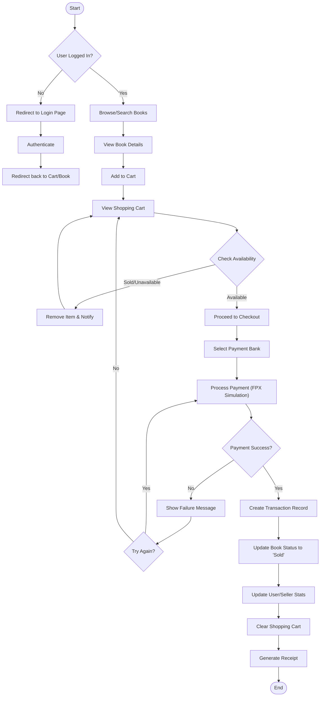
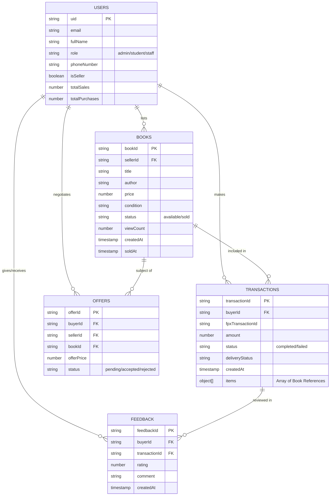

# 4.2 Project Design

This section outlines the architectural design of the UITM-EMPLC system, detailing user interactions, system workflows, and data structures.

## 4.2.1 Use Case Diagram (UCD)

The Use Case Diagram illustrates the primary actors (Student/Staff as Buyer/Seller, and Admin) and their interactions with the system.

```mermaid
useCaseDiagram
    actor "User (Student/Staff)" as User
    actor "Admin" as Admin

    package "UITM-EMPLC System" {
        usecase "Login / Sign Up" as UC1
        usecase "Manage Profile" as UC2
        
        usecase "Browse/Search Books" as UC3
        usecase "View Book Details" as UC4
        usecase "Add to Cart" as UC5
        usecase "Purchase Books (Checkout)" as UC6
        usecase "View Receipt" as UC7
        
        usecase "List Book for Sale" as UC8
        usecase "Manage Listings" as UC9
        usecase "Chat/Negotiate" as UC10
        
        usecase "Manage Users" as UC11
        usecase "Manage Books (Admin)" as UC12
        usecase "View Analytics & Health" as UC13
        usecase "Manage Feedback" as UC14
    }

    User --> UC1
    User --> UC2
    User --> UC3
    User --> UC4
    User --> UC5
    User --> UC6
    User --> UC7
    User --> UC8
    User --> UC9
    User --> UC10

    Admin --> UC1
    Admin --> UC11
    Admin --> UC12
    Admin --> UC13
    Admin --> UC14
```

### Actors Description
1. **User (Student/Staff)**: Can act as both Buyer and Seller.
   - **Buyer Role**: Browses books, adds to cart, makes purchases, and chats with sellers.
   - **Seller Role**: Lists books, manages inventory, and responds to potential buyers.
2. **Admin**: Manages the overall system, including user monitoring, content moderation (books/feedback), and viewing analytical dashboards.

---

## 4.2.2 System Flowchart

The System Flowchart demonstrates the core workflow of a user purchasing a book, which is the primary value proposition of the system.

### Purchase Flow


---

## 4.2.3 Entity Relationship Diagram (ERD)

The ERD visualizes the data structure within the Firebase Realtime Database, showing entities like Users, Books, Transactions, and their relationships.



### Entity Descriptions
- **USERS**: Stores profile information and aggregate statistics. Key roles include `admin` and regular users (students/staff).
- **BOOKS**: Represents the listings. Contains details like `sellerId` (link to User) and `status` (tracks availability).
- **TRANSACTIONS**: Records successful purchases. Links a Buyer to one or more Books. Stores financial details and delivery status.
- **OFFERS**: Manages price negotiations between buyers and sellers.
- **FEEDBACK**: Reviews left by buyers after a transaction is completed.
